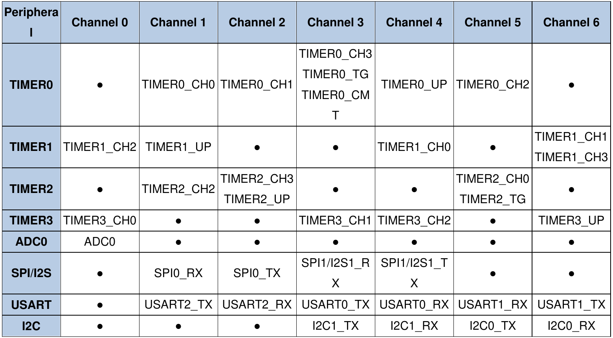
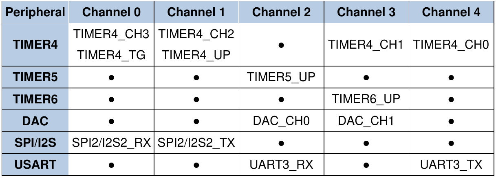

# Практическое применение RISC-V при программировании микроконтроллеров

[(Оглавление)](index.md)

# 10. DMA

Достаточно распространенными являются задачи копирования больших объемов данных из одного массива в другой, а еще чаще - передача между памятью и периферией. Как это часто бывает, задача элементарно решается старыми средствами (ручное копирвоание одному байту или посылка по одному байту на прерываниях), но именно поэтому ее оказалось легко автоматизировать и тем самым избавить ядро контроллера от рутины. Действительно, передача байтиков из памяти в память (не забываем, что периферия у нас это тоже MMIO, то есть память) не требует никакой фантазии или сложных алгоритмов. Знай дожидайся когда приемник и шина памяти освободятся, и посылай очередной байт. Механизм, который этим занимается, называется DMA (direct memory access, он же прямой доступ к памяти, ПДП).

## Копирование из памяти в память

Собственно, простейший способ, полностью отражающий название: есть буфер с данными, есть буфер без данных, надо перелить из пустого в порожнее, никаких ограничений на скорость. Код, который реализует это при помощи DMA, выглядит примерно так:

```c
  RCU_AHBEN |= RCU_AHBEN_DMA0EN;

  DMA_CHCTL(DMA0, 1) = 0;
  DMA_INTC(DMA0) = DMA_FLAG_ADD(DMA_CHINTF_RESET_VALUE, 1);
  DMA_CHMADDR(DMA0, 1) = (uint32_t)mem_src;
  DMA_CHPADDR(DMA0, 1) = (uint32_t)mem_dst;
  DMA_CHCNT(DMA0, 1) = sizeof(mem_src);
  DMA_CHCTL(DMA0, 1) = DMA_CHXCTL_M2M | DMA_PERIPHERAL_WIDTH_8BIT | DMA_MEMORY_WIDTH_8BIT | DMA_CHXCTL_MNAGA | DMA_CHXCTL_PNAGA  | DMA_CHXCTL_DIR;
  DMA_CHCTL(DMA0, 1) |= DMA_CHXCTL_CHEN;
  
  while( !(DMA_INTF(DMA0) & DMA_FLAG_ADD(DMA_INTF_FTFIF, 1)) ){}
```

Несложно увидеть что здесь происходит: задается адрес источника, адрес приемника и объем данных. Потом задается формат данных (копировать за раз по 8 бит из источника и класть в 8 бит приемника, после каждой итерации переходить к следующей ячейке того и другого, ну и так далее) и пауза в ожидании окончания передачи. Но пауза это, конечно, плохая идея, лучше в нужном месте основного кода флаг DMA проверять. Или задействовать прерывание.

Собственно и назначение у такого метода понятное: пока память копируется, можно заняться чем-то другим.

## Копирование в периферию

Но просто копировать буферы задача не слишком частая, особенно в контроллерах. Более ценен DMA в работе с периферией: можно обмениваться массивами, не тратя время на вход-выход из прерывания. Вместо генерации прерывания периферийный модуль (да хоть тот же UART) может сгенерировать специальное событие для DMA, и тот в ответ вышлет новую порцию данных. **ВАЖНО:** каждое такое событие строго привязано к конкретному DMA и конкретному каналу в нем.

DMA0:



DMA1:



В этих таблицах указано какая периферия умеет посылать события каждому из каналов (взято из рефмана, разумеется). Например, USART0 умеет посылать сообщение "готов к передаче" на DMA0, канал 3, и сообщение "вам тут байт пришел" на DMA0, канал 4. Другой пример - SPI2 умеет говорить "байт передан/принят (особенность SPI - прием идет только одновременно с передачей)", заберите/давайте следующий на DMA1, каналы 0 и 1. ~~Хм, только что подумал: так вот зачем там два канала сразу, если событие одно. Может ведь понадобиться одновременно и принимать и передавать данные, а на один канал два буфера на прием и два на передачу не повесить~~. И надо понимать, что события отдельно, буферы приема - передачи отдельно. Например, можно событие ловить от таймера, а писать в UART. Или событие от АЦП, а читать из GPIO. Но чаще всего, конечно, буфер данных используется от той же периферии, которая генерирует сигнал. Вот пример кода для передачи ранее скопированного буфера mem_dst по UART:

```c
  DMA_CHCTL(DMA0, 3) = 0;
  DMA_INTC(DMA0) = DMA_FLAG_ADD(DMA_CHINTF_RESET_VALUE, 3);
  DMA_CHMADDR(DMA0, 3) = (uint32_t)mem_dst;
  DMA_CHPADDR(DMA0, 3) = (uint32_t)&USART_DATA(USART0);
  DMA_CHCNT(DMA0, 3) = sizeof(mem_dst);
  DMA_CHCTL(DMA0, 3) = DMA_PERIPHERAL_WIDTH_8BIT | DMA_MEMORY_WIDTH_8BIT | DMA_CHXCTL_MNAGA | DMA_CHXCTL_DIR;
  DMA_CHCTL(DMA0, 3) |= DMA_CHXCTL_CHEN;
  
  USART_CTL2(USART0) = USART_CTL2_DENT;
```

Здесь внимание стоит обратить на три момента. Во-первых, в регистр приемника азписывается **адрес** регистра периферии, а не значение. Очень легко забыться и написать ```DMA_CHPADDR(DMA0, 3) = USART_DATA(USART0);```, но это работать не будет. Второе - нет флагов M2M и PNAGA. Отсутствие M2M указывает модулю DMA дожидаться сигнала, а отсутствие PNAGA запрещает увеличивать адрес приемника. Это ведь не массив байтов, а один и тот же регистр, в который мы подряд записываем кучу байтов. Ну и третье - настройка **UART** (не DMA, а именно периферии) на генерацию событий.

Ну и как уже было сказано, никто нам не мешает генерировать события таймером, а данные отправлять на какой-нибудь GPIO_BOP, благо BOP умеет переключать не все биты, а только те, где выставлены единицы. Кстати, таким способом можно организовать динамическую индикацию... только это непрактично.

Кстати, есть специальный бит CMEN, превращающий DMA в Сизифа: как только ~~камень~~ счетчик достигает конца, он сбрасывается в ноль, и ~~приходится толкать с начала~~ передача начинается по следующему кругу. Очень удобно для АЦП, когда он в автономном режиме пишет туда данные, а код, уже когда ему удобно, оттуда забирает, скажем, последние десять измерений. Или для той же динамической индикации.

## Важные особенности

1. DMA_CHMADDR и DMA_CHPADDR, хотя и называются "MEMORY" и "PERIPHERAL", по факту оба указывают на память. Вроде бы как где-то существуют контроллеры, у которых диапазон допустимых значений этих регистров отличается, и они не могут указывать куда угодно, но я с такими не сталкивался.

2. DMA_CHCNT это не размер буфера (в байтах там, или в машинных словах). Это количество транзакций. Например, если DMA_CHCNT равен 2, а размер транзакции составляет DMA_MEMORY_WIDTH_8BIT, будет скопировано именно 2 байта. А если при том же DMA_CHCNT размер указан DMA_MEMORY_WIDTH_32BIT, будет скопировано 8 байт. Понятно для чего это сделано: какой-нибудь АЦП за раз выдает 16-битное значение, было бы глупо копировать его в два захода. Или тот же BOP, который вообще 32-битный.

3. Размеры транзакций на передачу и на прием могут не совпадать. Тогда логика копирования такая же, как при обычном копировании массивов - старшая часть либо обрезается, либо дополняется нулями. Смещение по массивам тогда соответственно тоже будет идти с разным шагом.

4. Копирование данных идет через общую шину памяти, поэтому разные каналы могут мешать друг другу и основному коду. Чтобы решить, кто из них главнее, для каждого канала можно настроить 2-битную величину приоритета: низкий, средний, высокий, супер-высокий.

5. DMA умеет генерировать прерывания! Причем не только по окончании передачи, но и по возникновению ошибки, и даже по передаче половины буфера. Это может быть полезно для буферизации, когда с одной половиной буфера работает код (генерирует туда данные, например), а со второй - периферия.

## Заключение

Как видно, сама логика работы DMA проста до безобразия. Разумеется, под ней скрывается множество технических проблем вроде арбитража шины памяти, но для программиста это просто способ не забивать голову процессора такой простой задачей, как копирование кучи однообразных данных.

Исходный код примера доступен на [github](https://github.com/KarakatitsaRISCV/riscv-asm/tree/main/9.DMA)

### Д/З

1. Несмотря на непрактичность, в учебных целях реализовать динамическую индикацию через DMA. Вероятно, придется задействовать два канала таймера: один будет переключать знакоместа, второй - изображения.

2. Проверить, какой способ копирования M2M быстрее - ручной в цикле или через DMA. А если они запущены одновременно? А если поиграться с приоритетами?