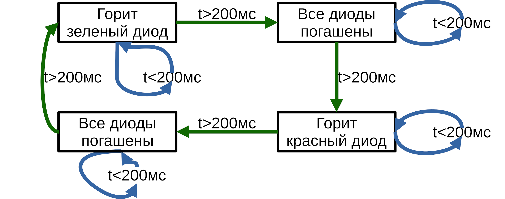
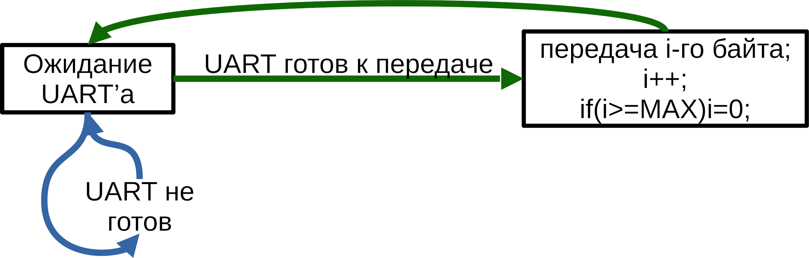

# Практическое применение RISC-V при программировании микроконтроллеров

[(Оглавление)](index.md)

# 11.Многозадачность

Необходимость выполнять на одном контроллере несколько алгоритмов одновременно у нас возникла довольно давно, но до сих пор мне удавалось обойтись простыми решениями. Для наглядности приведу пару примеров, которые уже упоминались в прошлых частях.

[Матричный дисплей](8.matrix.md) и [Таймеры](9.timers.md). И там, и там полный цикл алгоритма не выполнялся за один вызов функции. Он регулярно прерывался выполнением другого кода.

Нужды в более сложных методах организации многозадачности не возникало в основном из-за простоты кода. Собственно, я и старался сделать его максимально простым, чтобы не отвлекаться от темы рассказа. Но в реальных проектах практически всегда надо и датчики опрашивать (включая фильтрацию и прочую обработку сигналов), и с пользователем взаимодействовать, и логи вести, и ошибки ~~генерировать~~ отслеживать. При дальнейшем усложнении кода может возникнуть необходимость более хитрого взаимодействия процессов друг с другом или наоборот, ограничения этого взаимодействия (чтобы один процесс, например, не смог влезть в память другого, или начать что-то писать в периферию, которой тот уже пользуется). Неплохо бы выделить наиболее критичные процессы, которые бы вызывались чаще других. И наоборот, маловажные, которым процессорное время отводится по остаточному принципу. А может, мы и вовсе заходим подгружать исполняемый код с внешнего носителя? Надо же предусмотреть, что его может писать кто-то недостаточно квалифицированный, игнорирующий соглашения и считающий сегфолт нормой жизни. Надо определять, если процесс завис, ~~и менять его заголовок на "окно не отвечает"~~. Хотя нет, такого мы точно не захотим.

Но стоп. Специфика маломощных контроллеров вроде нашего GD32VF103, да и подавляющего большинства встраиваемых систем, все же не настолько разнообразна. Так например, практически всегда весь набор возможных процессов известен на этапе компиляции, и каждый из них запускается ровно в единственном экземпляре. Ну действительно, если уж мы написали процесс для работы с экраном, мы же не будем ожидать, что экран внезапно куда-то исчезнет. Не пользователь же с кусачками придет. Или с паяльником, новый прикручивать. Поэтому с динамическим размещением переменных, да и вообще с динамической памятью нам возиться не придется, что уже сильно упрощает задачу.

Иллюстрировать различные способы организации многозадачности я буду при помощи прочтого алгоритма, состоящего из двух процессов. Первый будет переключать светодиоды, а второй - бесконечно отправлять по UART'у какой-то текст.

## 11.1 Ручное переключение (резидентные программы)

В прошлом тысячелетии, когда однозадачные системы были вершиной компьютерной мысли, уже возникала необходимость хоть как-то запустить две программы одновременно. Ну хотя бы пишет человек отчет, и ему понадобилось посчитать какое-то выражение на калькуляторе. Или программирует в супер-современной среде разработки вроде Borland Pascal - и понадобилось запустить свой код для проверки. Это ведь тоже процесс, такой же, как и сама IDE. Решением было выделить разным программам разные участки памяти, но вот переключение между ними оставить на усмотрение человека.

В чистом виде в контроллерах это по понятным причинам не встречается: они все же про автономную работу, а не про закат Солнца вручную.

## 11.2 Конечный автомат

Внимание! Это не общеупотребимый термин. На самом деле это специфичная вариация следующейго пункта - **кооперативной многозадачности**. Однако сам подход к записи класса алгоритмов очень часто используется, особенно в контексте работы с железом.

Это самая простая реализация многозадачности. Примеры реализации я приводил в самом начале, теперь же попробую сформулировать в более общем виде.

Каждый процесс представляет из себя функцию, которая вызывается из основного цикла, быстро отрабатывает и возвращает управление. Если для выполнения алгоритма нужно, чтобы он продолжался с заданного места, можно использовать глобальные или статические переменные, а иногда и регистры периферии. Все это вместе и называется состоянием - по сути, место в коде, на котором выполнение прервалось, и с которого продолжится при следующем вызове. При очередном вызове функции процесса, он может изменить свое состояние или, если требуется подождать, оставить старое и быстренько завершиться.

Для примера приведу диаграммы описанного ранее алгоритма:





А вот как это выглядит в коде. Полный код примера можно посмотреть на [GitHub](https://github.com/KarakatitsaRISCV/riscv-asm/tree/main/10.Multitask_finite_state_machine)

```c
void task1(){ //LEDs
  static uint8_t state = 0;
  static int32_t t_av = 0;
  const int32_t t_delay_cyc = 200 * (F_SYS / 1000);
  int32_t t_cur = read_mcycle();
  switch(state){
    case 0:
      if( (t_cur - t_av) > 0){
        t_av = t_cur + t_delay_cyc;
        GPO_OFF(GLED);
        state = 1;
      }
      break;
    case 1:
      if( (t_cur - t_av) > 0){
        t_av = t_cur + t_delay_cyc;
        GPO_ON(RLED);
        state = 2;
      }
      break;
    case 2:
      if( (t_cur - t_av) > 0){
        t_av = t_cur + t_delay_cyc;
        GPO_OFF(RLED);
        state = 3;
      }
      break;
    case 3:
      if( (t_cur - t_av) > 0){
        t_av = t_cur + t_delay_cyc;
        GPO_ON(GLED);
        state = 0;
      }
      break;
    default: state = 0;
  }
}

void task2(){ //UART
  static uint16_t idx = 0;
  if( ! (USART_STAT(USART0) & USART_STAT_TBE) )return;
  USART_DATA(USART0) = uart_data[idx];
  idx++;
  if(idx > sizeof(uart_data))idx = 0;
}
...
int main(){
...
  while(1){
    task1();
    task2();
  }
}
```

Еще раз обращаю внимание: **никаких "тупых" задержек.** Если нужна задержка по времени или ожиданию флага периферии, она выполняется однократным опросом и, если событие не наступило, возвратом в основной цикл. Иначе "тупая" задержка будет тормозить вообще все.

Такой способ организации многозадачности самый простой и быстрый (меньше всего накладных расходов). Но при этом код процессов получается непривычным и сложным для понимания. Ну и разумеется, никакой защиты от дурака.

Стоит еще раз обратить внимание, что именно такой подход сплошь и рядом используется при работе с периферией. Причем с обеих сторон - и когда контроллер ей управляет, и когда сам ей является. Первые примеры, которые мне вспомнились, это организация JTAG и логика работы с USB-флешками.

## 11.3 Кооперативная (совместная)

Этот способ реализации многозадачности является логичным продолжением предыдущего. Мы ведь уже изучали ассемблер, и знаем, где там хранится состояние программы в общем виде - в регистре ProgramCounter, в переменных и на стеке. Следовательно, можно написать функцию, которая бы это состояние где-то сохраняла, потом восстанавливала состояние следующего процесса, и возвращала управление уже ему. Вообще-то, напрямую читать PC нельзя, но мы ведь пишем специальную функцию по переключению процессов, и вот в нее он приедет под именем регистра ra.

Для хранения состояния процессов логично выделить каждому из них персональный стек. Ну а все стеки собрать в массив и переключаться между ними. Я просто выделил массив из 10 стеков по килобайту каждый. Заодно там же, на стеке процесса, можно хранить и остальные регистры между переключениями. Кода получилось многовато (чуть меньше сотни строк ассемблерного кода), чтобы вставлять сюда, но исходник моего примера лежит на [GitHub](https://github.com/KarakatitsaRISCV/riscv-asm/tree/main/11.Multitack_Cooperative), можно посмотреть там.

Вызывать функцию переключения процессов руками неудобно (главным образом потому, что велик риск забыть), поэтому ее часто встраивают в некоторые системные функции. В первую очередь - в функции задержки.

И, как обычно, подобные алгоритмы подвержены атакам. Например, я слышал, как на древнем терминальном сервере, устроенном именно по такому принципу, нашелся маньяк, который написал свою программу так, что она вообще не использовала системных функций, соответственно не происходило переключения на другие процессы, и все процессорное время досталась только ему. Коллеги были слегка недовольны.

## 11.4 Вытесняющая

Сам собой напрашивается следующий шаг: не доверять процессу, и переключать его принудительно в прерывании таймера. При этом, разумеется, появляются новые проблемы. Самое банальное - надо сохранять не только сохраняемые регистры (s0 - s11), и не только те, что используются в самом прерывании, а вообще все. Включая CSR вроде mepc. Впрочем, как раз это не проблема, сохранять регистры мы умеем. В качестве таймера для переключалки процессов отлично подойдет рассматривавшийся в прошлый раз mtime - все равно он ущербный, и ни на что другое не пригоден. Здесь код получился еще больше (150 строк), но на [GitHub](https://github.com/KarakatitsaRISCV/riscv-asm/tree/main/12.Multitask_preemptive) пока помещается.

А вот что действительно является проблемой, так это взаимодействие процессов друг с другом и с периферией. Например, один начал писать uint64_t в общаю память, и на середине его прервали, так что записалась только половина. А второй процесс начал читать, и получил этакую химеру: нос от кошки, хвост от картошки. Разумеется, можно на время записи в общую память, запрещать прерывания, но это лишнее усложнение кода - можно банально забыть. Поэтому во "взрослых" операционных системах вводят атомарные типы данных, очереди, семафоры и прочие средства синхронизации. При работе с которыми возникает свой, доселе неизвестный пласт проблем.

Но появляются и новые возможности! Поскольку распределением процессорного времени теперь занимаются не сами процессы, а специально обученный планировщик (то есть ядро операционной системы), можно накрутить еще более интересную логику переключения. Скажем, назначить каждому процессу приоритет: этот у нас следит за наличием батарейки, его будем вызывать почаще, а этот общается с пользователем - его пореже. И реакция на прерывания тоже упрощается: можно прямо из прерывания "переключить процесс" на нужный, а может, если не так спешно, просто поднять ему приоритет.

**Это, кстати, важный момент.** В контроллерах сплошь и рядом встречается необходимость быстрой реакции на внешние события, независимо от того, что кто-то там решил посчитать число Пи до пиллионного знака. Если возникло прерывание - срочно (но без фанатизма, сбой прошивки нам тоже не нужен) откладываем остальные дела и обрабатываем событие. Операционные системы, заточенные на это, называются операционными системами реального времени (**ОСРВ**, real-time operation system, **RTOS**). В компьютерных ОС такого требования нет, там большинство задач вычислительные, и операционная система имеет полное право тупить,  сбрасывать подкачку на диск и дожидаться других долгих операций, на время которых даже интерфейс перестает отвечать.

Ну и раз уж мы отобрали у процесса возможность переключать контексты, логично отобрать и доступ к произвольной области памяти (в ну как в чужой стек упадет случайно?), периферии (а вдруг ее уже кто-то другой использует?) и регистрам ядра.

Решением этой проблемы, кстати, является появление драйверов устройств, зачастую даже иерархических. Представим ситуацию, что на одном SPI у нас висит и дисплей, и microSD-карта. Разрешить им доступ напрямую к регистрам нельзя, поэтому надо написать специальный драйвер SPI, который, если что, скажет "я сейчас общаюсь с дисплеем, подожди". А уже к этому драйверу будут обращаться драйверы дисплея, флешки и прочей периферии, которую мы захотим туда подключить.

## 11.5 множество ядер, каждое под свой процесс

Этот вариант в чистом виде практически никогда не используется, разве что на видеокартах. Крайне специфичный вариант многозадачности, поскольку предполагает, что аппаратных вычислителей больше, чем процессов. Переключения нет, но сами процессы максимально линейные (потому что вычислитель простой, у него нет развесистой логики обработки ветвлений). Не самое экономное использование транзисторов на кристалле, куча проблем с синхронизацией отдельных процессов (опять же если это не видеокарта, где процессы драг с другом взаимодействовать не могут) друг с другом и с памятью. Зато максимальная производительность.

## 11.6 Гибрид

Как обычно, разработчики стремятся скрестить различные подходы, чтобы минимизировать недостатки и объединить достоинства. Так например, обработчики прерывания, вот хоть ты тресни, а устроены по принципу конечного автомата. Переключение обычных процессов осуществляется по вытесняющему принципу, но если процессу надо подождать (неважно, пока переходные процессы закончатся, или пока посылка по DMA улетит), он добровольно передает управление другим по методу кооперативной. В современных компьютерах обычно больше одного ядра, и было бы глупо не воспользоваться наработками из многоядерных ОС.

К счастью, собственно, писать ОС с нуля приходится невероятно редко, потому что уже существует куча готовых, проще их допилить. А в готовых ОС все эти особенности уже учтены. А вот чтобы ими грамотно пользоваться, надо, во-первых, понимать, как все это устроено изнутри (не обязательно с точностью до ассемблерной инструкции, достаточно в общих чертах), а во-вторых, как это предполагается использовать по мнению разработчиков ОС. То есть изучить примеры кода.

# Заключение

Вот мы и познакомились с основными способами организации многозадачности в контроллерах. Надеюсь, теперь читателю будет проще выбрать чем воспользоваться в своем проекте, понять, чем воспользовался автор кривульки, которую он ковыряет, и для чего годится тот или иной подход.

Ну и, надеюсь, стали понятнее принципы функционирования и обычных, компьютерных ОС - по сути ведь там тоже самое, пусть на несколько порядков более сложное.

Как обычно, ссылки доступны на GitHub: [конечный автомат](https://github.com/KarakatitsaRISCV/riscv-asm/tree/main/10.Multitask_finite_state_machine); [кооперативная многозадачность](https://github.com/KarakatitsaRISCV/riscv-asm/tree/main/11.Multitack_Cooperative); [вытесняющая многозадачность](https://github.com/KarakatitsaRISCV/riscv-asm/tree/main/12.Multitask_preemptive).

## Д/З

1. Перепишите примеры опроса клавиатуры и отображения на дисплее под конечный автомат (в смысле вынести в отдельную функцию, обозначить состояния и переходы)

2. Реализуйте методом конечного автомата алгоритм современного светофора - когда желтый может мигать и гореть одновременно с красным, когда отображается оставшееся время и т.п.

3. Почитайте хотя бы про одну ОСРВ