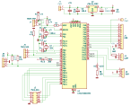
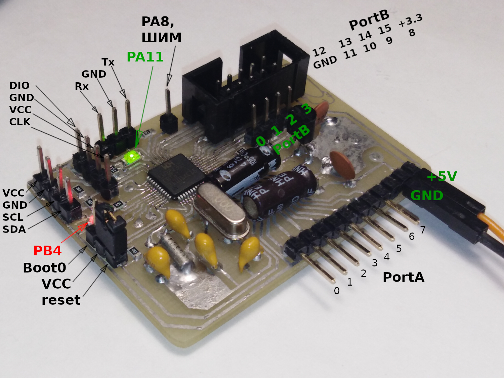

# Практическое применение RISC-V при программировании микроконтроллеров
[(Оглавление)](index.md)

## 1. WinChipHead (WCH)

В качестве альтернативы изучавшемуся ранее GD32VF103 можно рассмотреть линейку RISC-V контроллеров от WinChipHead (WCH). Основное преимущество перед GigaDevice в том, что линейка там не одна, а множество. Под любые задачи, от пятикопеечных поделок, котоые не жалко сломать или потерять (вроде CH32V003), до многоногих монстров со встроенным high-speed usb, ethernet или bluetooth (CH32V307, CH32V208). Если же говорить в контексте учебного пособия, стоит рассмотреть два варианта: CH32V303 и CH32V203. Оба полноценные 32-битные RISC-V, способные работать на скоростях до 144 МГц и обладают более чем достаточным объемом памяти. Особенность V303 в более навороченном ядре: оно поддерживает в числе прочего работу с 32-битными дробными числами и модуль защиты памяти. Зато V203 можно найти в более удобном корпусе, под него проще развести плату в домашних условиях. Соответственно отладочную плату для стенда логично делать на основе V303, а для самостоятельного изучения - на V203. Если, конечно, речь идет именно о первом знакомстве. Если же разводка 48- или 64-ногого корпуса с шагом 0,5мм не вызывает ужаса, никто не запрещает изучить ассортимент и самостоятельно выбрать наиболее подходящий камень.

Также должен предупредить о возможных проблемах с контроллерами от WCH. В первую очередь это прошивка. В отличие от GD32, со стандартным софтом эти контроллеры не дружат. Придется немного поплясать с бубном, но об этом в конце. Второе - в контроллерах с малым числом выводов может не оказаться возможности подключить кварцевый резонатор, а то и линии Boot1, Boot0 и даже reset. Тут просто надо быть бдительнее и тщательно проверять распиновку. Ну и в-третьих, само ядро QingKe, на котором эти камни основаны, не в полной мере соответствует спецификации RISC-V. Например, там нет регистра mcycle.

## 2. Документация

С этим у WCH все не так уж плохо, хотя и хуже, чем хотелось бы. Некоторые модули описаны довольно скудно, а некоторые, вроде bluetooth, не описаны совсем. Впрочем, большая часть периферии совместима с периферией от GD32 или STM32, так что можно подглядывать еще и в их документацию.

Как бы то ни было, для работы с контроллером необходимо скачать минимум три документа: [reference manual](https://www.wch-ic.com/downloads/CH32FV2x_V3xRM_PDF.html) (описание периферии и регистров всей линейки), [datasheet](https://www.wch-ic.com/downloads/CH32V20x_30xDS0_PDF.html) (описание конкретных камней, их распиновка и электрические параметры) и [processor manual](https://www.wch-ic.com/downloads/QingKeV4_Processor_Manual_PDF.html) (описание ядра). Также полезно поискать пример фирменной отладочной платы чтобы удостовериться, что на своей все дорожки будут подключены правильно, и примеры кода. Они, правда, в основном под фирменную среду разработки от WCH, **Mounriver studio**, но подсмотреть все-таки можно.

При разработке схемы и печатной платы напрямую пользоваться распиновкой из даташита неудобно: она там приведена для большого количетва корпусов и не структурирована по периферии. Поэтому имеет смысл создать, скажем, электронную таблицу и перенести в нее данные, относящиеся именно к выбранному контроллеру. Заодно в ней же можно делать пометки какой вывод чему соответствует в разрабатываемом устройстве.

Рисование схемы отладочной платы не слишком отличается от схемы для того же GD32, но лишний раз напомню на что стоит обратить внимание. **Гребенки портов** - не обязательно всех, но чтобы на них поадала вся нужная периферия. Я обычно выводу PA0-PA7 на угловую гребенку, чтобы плату можно было куда-то воткнуть, и PB8-PB15 на разъем под шлейф. **Питание** - удобно когда на тех же гребенках есть линии +5 В до стабилизатора, +3.3 В после, и несколько земель. Можно и отладочную плату от внешней схемы запитать, и наоборот. Если планируются опыты с режимами сна и пониженным потреблением, стоит разорвать линию +3.3 В от стабилизатора до контроллера и поставить в разрыв джампер. В обычном режиме он замкнут и не мешает работе, но при желании вместо него можно воткнуть амперметр и смотреть потребление. **UART** - даже если основное программирование предполагается через штатный протокол SWD, предусмотреть UART все-таки стоит. Отладка лишней не будет, да и резервный способ программирования тоже. Причем очень удобной оказалась распиновка Rx - GND - Tx. Любые два UART-устройства можно соединить трехжильным кабелем. **Boot0, RESET** - как и UART, их стоит вывести на разъемы даже если использование не планируется. **Индикация и управление** - хотя бы 2 - 3 светодиода и 1 - 2 кнопки. Очень удобно смотреть в каком режиме в данный момент работает программа.

В результате у меня получилась вот такая схема:





## 3. Изготовление платы

Самый простой способ изготовления отладочной платы - не изготавливать ее. Можно купить сразу готовую, можно заказать изготовление в соответствующих фирмах. Чуть более сложный, но полезный в учебных целях способ - самостоятельное изготовление. Возможно, лазерно-утюжным методом, фоторезистивным или даже механическим прорезанием (да, для V203 это не слишком сложно). Эти технологии неоднократно описаны, останавливаться на них не буду.

## 4. Программирование

А вот о программировании CH32 рассказать стоит. К сожалению, разработчики не взяли пример с GD32 и не сделали свой загрузчик (bootloader) совместимым с существующими программами вроде stm32flash или dfu-utils. Вместо этого они разработали собственный протокол обмена, причем довольно странный. И точно так же они поступили с отладочным интерфейсом. Вместо того, чтобы реализовать обычный JTAG или SWD, они опять-таки написали свой, уникальный протокол. Тем не менее, способы прошивки как через USB, так и UART и SWD, существуют. Хотя чтобы их запустить, пришлось изрядно постараться. Так, при использовании загрузчика, прошивка зачем-то шифруется. Причем довольно примитивным способом, так что сам смысл шифрования мне, если честно, непонятен. Тем не менее, чтобы разобраться как же оно реализовано, мне пришлось анализировать лог обмена и дизассемблировать загрузчик (если кому-то вдруг интересно, частичный результат [доступен](https://github.com/COKPOWEHEU/ch32v307_bootloader)). В результате была написана утилита [wch-isp](https://github.com/COKPOWEHEU/wch-isp), которая и позволяет прошивать контроллеры через USB и UART. Справедливости ради, существуют и другие подобные утилиты: [wch-isp от jmaselbas](https://github.com/jmaselbas/wch-isp), [wch-isp на rust](https://github.com/ch32-rs/wchisp) а также утилиты от самых WCH - неудобные и без исходников. Я, естественно, буду пользоваться своей.

### 4.1. Прошивка через USB

Ножка Boot0 соединяется с питанием, контроллер подключается к компьютеру по USB, запускается программа прошивки, ножка Boot0 снова соединяется с землей и контроллер переподключается. Все максимально просто и не требует никакого оборудования, но нужно водиться с переподключениями. Как результат, чтобы один раз залить готовую прошивку годится, но для использования в повседневной отладке - нет. Командная строка для прошивки при помощи wch-isp выглядит примерно так:

```
$ ./wch-isp write firmware.bin
```


### 4.2. Прошивка через UART

В целом аналогично предыдущему варианту, но добавляется внешняя плата переходника USB-UART или RS232-UART. Соответственно в заклинание для прошивки добавляется имя порта:

```
$ ./wch-isp --port=/dev/ttyUSB0 write firmware.bin
```

Казалось бы, все только усложнилось, зачем такой способ вообще нужен. А разница в том, что протокол RS232, эмулируемый переходниками, помимо линий данных Rx, Tx, поддерживает также служебные линии DCD, RTS, RI и прочие. Причем линии RTS и DTR используются компьютером чтобы сообщить свое состояние подключенной к нему схеме (остальные - чтобы схема могла сообщить компьютеру свое состояние, и потому в данном случае бесполезны). И эти линии на многих переходниках выведены наружу. Для нас это означает, что можно соединить, например, RTS с линией RESET, а DTR с Boot0 и, дергая их в нужном порядке, переключаться между режимами программирования и рабочим автоматически. Больше никакой возни с джамперами! Мало того, после прошивки переходник на UART остается переходником на UART, и может быть использован для отладки:

```
$ ./wch-isp --port=/dev/ttyUSB0 --reset=RTS --boot0=DTR write firmware.bin
```

Вот такого, насколько я понял, ни одна утилита кроме моей не умеет. Что довольно странно, на самом деле. Для справки, программирование проводится на скорости 115200, поэтому и для отладки имеет смысл выставить ту же скорость. Меньше риск потери байтов во время переключения режимов.

### 4.3. Каракатица

Как и в случае GD32VF103, для прошивки можно применить Каракатицу. Причем оказалось, что придуманный еще тогда механизм управления Boot0, RESET несколько удобнее, чем через RTS, DTR (хотя не исключаю, что виновата именно моя кривая реализация). Так что механизм прошивки остается прежним, разве что ```stm32flash``` меняется на ```wch-isp```:

```
stty -F /dev/tty_STFLASH_0 300
stty -F /dev/tty_STFLASH_0 50
echo 'RBU' > /dev/tty_STFLASH_0
echo 'rBU' > /dev/tty_STFLASH_0
sleep 1
./wch-isp --port=/dev/tty_STFLASH_0 write firmware.bin
stty -F /dev/tty_STFLASH_0 50
echo 'RbU' > /dev/tty_STFLASH_0
sleep 1
echo 'rbuz' > /dev/tty_STFLASH_0
```

Именно этот механизм будет основным на стенде.

### 4.4. SWD / OpenOCD

Контроллеры CH32 умеют программироваться и отлаживаться и через специальный интерфейс SWD. Проблема в том, что для этого нужен именно программатор от самих WCH, wch-link (обычный st-link или ft2232 не подойдут) и специально пропатченный openocd (обычный также не подойдет). Что интересно, схемы wch-link доступны в открытом доступе, также как и бинарники прошивок (не исходники, увы), так что в принципе возможно взять какой-нибудь CH32V208 и собрать на нем программатор для другого CH32V208.

Собрать пропатченный OpenOCD тоже оказалось тем еще приключением. Спасибо **Alexander Bulychev** за [подробную инструкцию](https://gist.github.com/legath/8063986f2750ffbdfb595d0ac2bd28a2)

```
apt install libusb-1.0-0-dev libhidapi-hidraw0 libhidapi-libusb0 libhidapi-dev libtool make pkg-config
git clone "https://github.com/benpye/openocd"
cd openocd 
./bootstrap
./configure --disable-werror --enable-wlinke --disable-ch347
# --disable-linuxgpiod нужен только для arch based дистрибутивов, потому что версия библиотеки убежала в системе далеко вперед
make
```

Естественно, все зависимости должны быть установлены.

Файл настроек можно взять из Mounriver Studio, а можно и [отсюда](files/wch-riscv.cfg).

Также, чтобы не приходилось запускать openocd (да и другие утилиты тоже) от рута, нужно настроить udev. Для WCH файл правил может выглядеть так:

```
SUBSYSTEM=="usb", ATTR{idVendor}="1a86", ATTR{idProduct}=="8010", GROUP="plugdev", MODE="0666", TAG+="uaccess"
SUBSYSTEM=="usb", ATTR{idVendor}="4348", ATTR{idProduct}=="55e0", GROUP="plugdev", MODE="0666", TAG+="uaccess"
SUBSYSTEM=="usb", ATTR{idVendor}="1a86", ATTR{idProduct}=="8012", GROUP="plugdev", MODE="0666", TAG+="uaccess"
```

Лично мне при сборке не понравилась необходимость флага ```--disable-werror``` и общее количество ошибок, которыми местный openocd сыплет при сборке. Впрочем, работать он работает.

Простейшая прошивка через openocd:

```
openocd -f wch-riscv.cfg -c init -c halt -c "program $(file).hex" -c exit
```

### 4.5. Mounriver Studio

Ну и еще один вариант программирования и отладки - скачать фирменную среду разработки, в которую входит и компилятор, и эмулятор, и отладчик, и пользоваться ей.