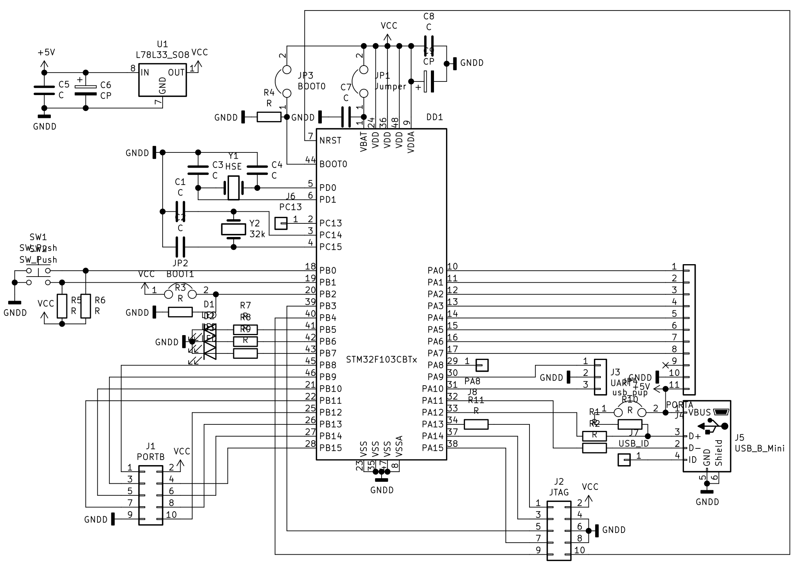

# Практическое применение RISC-V при программировании микроконтроллеров

[(Оглавление)](index.md)

## 2.1. Работа с документацией

В первую очередь, как и в случае любой электроники, надо найти электрическую схему или хотя бы распиновку. Как иначе узнать на каких выводах что висит и на какие выводы что подавать? В случае самодельной платы они и так есть (схему и распиновку отладочной платы, на которой я буду все демонстрировать, можно увидеть на рисунках ниже). В случае готовых - искать на сайте производителя.

Отдельно стоит предостеречь, что максимальное допустимое напряжение питания для GD32VF103 составляет 3.6 В, напряжение на многих ножках также ограничено этой величиной. Есть, правда, и специальные ножки, способные выдерживать подачу на них 5 В, но с ними надо быть еще аккуратнее, поскольку такой широкий диапазон напряжений был получен ценой отказа от защитных диодов. На обычный 3.6-вольтовый вывод все же можно подать, скажем, 12 В через ограничительный резистор - защитный диод будет изо всех сил сбрасывать избыток напряжения на линию питания, и пока не превышена его нагрузочная способность (она небольшая, вряд ли больше пары миллиампер), не позволит ему выйти за безопасный предел. Но на 5-вольтовых линиях такой защиты нет, и если подать туда слишком большое напряжение - уже безразлично, с резистором или без - можно легко пробить транзисторы. На практике, конечно, на подобных схемах типичные напряжения 2 - 5 В, а силовые цепи тщательно отделены от сигнальных, но осторожность соблюдать надо.

**UPD:** В документации на GD32VF103 мне этого найти не удалось, но для STM32F103 (откуда, похоже, срисована архитектура) говорится, что у 5-вольтовых линий есть свое питание и какая-никакая защита. При этом величина втекающего тока ограничена 0 мА, то есть даже там подавать высокое напряжение не стоит. Если уж на ножке может оказаться что-то выше 5 В, поставьте внешний токоограничивающий резистор и либо диод к питанию, либо стабилитрон.




[Список регистров](files/GD32VF103.html)

Следующим важным документом является **Datasheet** и **User Manual** (иногда также называется **Reference manual**) на контроллер. Скачать их можно (и нужно!) с официального сайта производителя. В Datasheet приведены электрические и механические характеристики - допустимые напряжения и токи, потребление, тайминги. Что важно, в нем приведена распиновка, то есть то, какая функциональность соответствует каждой ножке корпуса. Например, на странице 31 можно увидеть, что 12-я ножка по умолчанию работает как PA2, но может быть перенастроена на USART1_TX, TIMER4_CH2, ADC01_IN2 или TIMER1_CH2. Лично мне пользоваться таблицей из даташита оказалось неудобно и я свел эти данные в [электронную таблицу](https://github.com/KarakatitsaRISCV/riscv-asm/blob/main/doc/gd32vf103cbt6.ods).

**User Manual** / **Reference Manual** - описание встроенной периферии контроллера. В нем описан принцип ее работы, возможности, а главное - регистры и биты в них. Вот этот документ должен быть под рукой всегда.

## 2.2. Взаимодействие с периферией

Микроконтроллер, как и микропроцессор - в первую очередь вычислительное устройство, но исходные данные ему нужно откуда-то взять, а результат куда-то отправить. Такое взаимодействие с внешним миром осуществляется при помощи периферийных устройств, то есть аппаратных модулей, не входящих в ядро процессора и предназначенных переводить его сообщения на язык, понятный окружающим. Например, в нашем gd32vf103 есть такая периферия как порты ввода-вывода (каждый бит переданного туда числа отображается как уровень напряжения на ножке), ШИМ-таймеры (число представляется как соотншение длительности импульса к длительности паузы), UART, USB (последовательность импульсов) и т.д.

В некоторых контроллерах для взаимодействия с периферией используются специальные команды, обычно ```in, out```. В них указывается номер порта и число, которое туда надо послать. Номер порта у каждого периферийного устройства свой, намертво прибит при изготовлении контроллера и описан в документации.

А как ввод-вывод можно сделать по-другому? Давайте предположим, что мы можем волшебным образом заглянуть в мозги контроллера и считать информацию непосредственно оттуда. Впрочем, магия для этого не нужна, ведь прекрасно известно где находится оперативная память и как с ней работать. Вот только городить целую схему "подсматривания" за всей памятью было бы довольно сложно и неудобно. Давайте лучше выделим диапазон адресов, в которые контроллер сам будет писать то, что хочет сообщить. А еще лучше, чтобы через эти адреса он сообщал не "подсматривателю", а сразу нужной периферии. Таким образом мы вернулись к идее портов, но без необходимости вводить лишние сущности вроде команд ```in, out```. Разумеется, эти адреса также жестко заданы и описаны в документации. Например, в gd32vf103 по адресу ```0x4001 2C00``` находятся настройки одного из таймеров, а по адресу ```0x4001 0C00``` - настройки PortB. Этот подход, отображение периферии на память называется memory-mapped input-output, MMIO и применяется как в нашем контроллере, так и во многих других контроллерах и процессорах.

## 2.3. Первая программа

Традиционно первой программой для контроллера является blink - мигание светодиодом. Действительно, у нас ведь нет монитора, на который можно было бы вывести Hello World. Мигать светодиодом будем самым простым способом - подавая на соответствующую ножку поочередно 0 и 3.3 В (лог.0 и лог.1 соответственно). Если посмотреть на схему, светодиоды соединены с ножками PB5, PB6, PB7. Но прежде надо ножку, да и весь контроллер, настроить.

В самом начале упоминалось, что одной из специфик микроконтроллеров и встраиваемых систем вообще может являться минимально возможное энергопотребление. Оно достигается как специальными режимами работы (или не-работы, то есть сна, sleep-mode), так и отключением неиспользуемой периферии.

Чтобы включить периферию и сделать ее используемой, надо разрешить ее тактирование. Делается это в регистрах *RCU_AHBEN*, *RCU_APB1EN*, *RCU_APB2EN* в зависимости к какой из внутренних линий данная периферия подключена. PORTB, на котором висят светодиоды, висит на APB2 и управляется 3-м битом соответствующего регистра. Чтобы разрешить тактирование, надо этот бит выставить в 1, не трогая при этом остальные биты. Мало ли, вдруг порт - не первое, что настраивается в программе. Можно, конечно, заранее просчитать все, что будет использовано, но при отладке очень легко что-то упустить. Нет уж, каждая периферия будет настраиваться сама по себе, не трогая соседей. Чтобы поменять один бит используются так называемые битовые маски, о которых будет подробно рассказано позже.

    .equ RCU_APB2ENR_PBEN, (1<<3)
    .equ RCU_APB2ENR, 0x40021018
    ...
      li t0, RCU_APB2ENR
      lw t1, 0(t0)
        ori t1, t1, RCU_APB2ENR_PBEN
      sw t1, 0(t0)
  
Далее надо настроить сам порт. Поскольку никто заранее не знает как именно будет использоваться контроллер, порты ввода-вывода сделаны универсальными: они могут работать на вход (читать что на них подала внешняя схема), на выход (выдавать на внешнюю схему сигналы) или управляться какой-либо периферией. Так, упомянутый ранее PA2 может быть не только обычным портом ввода-вывода, но и линией передачи модуля USART, служить входом для АЦП или соединяться с таймерами 1 или 4. За режим работы отвечают биты **CTL** и **MD** регистров **GPIOB_CTL0**, **GPIOB_CTL1**, причем разделены ножки между регистрами пополам: PB0 - PB7 относятся к **GPIOB_CTL0**, а PB8-PB15 к **GPIOB_CTL1**. Это несколько усложняет программирование, но к счастью менять режим вывода требуется нечасто. Если посмотреть в Reference Manual, можно найти, что режиму push-pull, 50 МГц (обычный выход на максимальной частоте) соответствует CTL=00, MD=11, то есть четверка битов 0b0011, которую и надо записать в регистр **GPIOB_CTL0**. Опять же, не трогая остальных битов. Адреса регистров в документации указываются как базовый адрес плюс смещение. В случае порта **B** базовый адрес равен **0x40010C00**. От него отсчитываются все регистры, управляющие портом.

    .equ PORTB_BASE,  0x40010C00
    .equ PORTB_CTL0,  (PORTB_BASE + 0x00)
    .equ LED, 5
    ...
      li t0, PORTB_CTL0
      lw t1, 0(t0)
        li t2, ~(0b1111 << (4*LED))
        and t1, t1, t2
        li t2, 0b0011 << (4*LED)
        or t1, t1, t2
      sw t1, 0(t0)

Здесь битовая магия еще страннее, чем в RCU_APB2EN, она сначала обнуляет 4 бита, отвечающих за PB5, а потом выставляет их в 0b0011.

Стоит немного пояснить, чем отличаются скорости работы порта, если все переключения задаются из кода, где их могут деграть хоть 54 миллиона раз в секунду. На самом деле это всего лишь скорость нарастания и спада фронтовсигнала. Микроконтроллер ведь не сферический в вакууме существует, у него есть конечное сопротивление выходных цепей, конечная емкость. И чтобы эту емкость перезарядить, нужен конечный ток. И чем этот ток больше, тем быстрее она перезарядится. То есть если выставить скорость минимальной (минимальный ток) и начать быстро-быстро дрыгать ногой, вместо красивого прямоугольного меандра получится синусоида. С другой стороны, большой ток это большое потребление и большие помехи на внутренних цепях. У нас пока нужды экономить питание нет, а аналоговые узлы не используются, поэтому выбираем максимальную частоту и не паримся.

Теперь порт настроен, и им можно наконец мигать. Для этого в нужный бит регистра PORTB_OCTL надо записывать последовательно 0 и 1 - это же значение появится на ножке. Чтобы просто инвертировать один бит переменной, существует очень удобная логическая операция - исключающее или, она же XOR:

    .equ PORTB_OCTL,  (PORTB_BASE + 0x0C)
    ...
      li t0, PORTB_OCTL
      lw t1, 0(t0)
        xori t1, t1, (1<<LED)
      sw t1, 0(t0)
      
Теперь светодиод начал мигать, правда со слишком большой скоростью, ведь по умолчанию контроллер тактируется от частоты 8 МГц. Чтобы замедлить мигание, достаточно вставить "тупую задержку":

      li t0, 500000
    sleep:
      addi t0, t0, -1
      bnez t0, sleep
      
Термин "тупая задержка" обозначает, во-первых, что во время нее контроллер не занимается ничем полезным, а во-вторых, что задержка завязана на подсчете тактов и не является точной. Такие задержки могут использоваться в простом коде, когда контроллеру все равно больше нечем заняться, или если задержка слишком мала чтобы за время нее успеть выполнить что-то другое.

Вот теперь контроллер начал мигать светодиодом.

## 2.4. Обработка кнопки

Раз уж про вывод рассказано, имеет смысл рассказать и про ввод, на примере обработки кнопки, котор6ая висит на PB0 Если за вывод ножки отвечал регистр OCTL, то за ввод - ISTAT. Точно так же каждый бит соответствует одной ножке. И естественно не забываем настроить CTL0 на вход - этому соответствует четверка битов 0b0100:

    .equ BTN, 0
    ...
      li t0, PORTB_CTL0
      lw t1, 0(t0)
        li t2, ~(0b1111 << (4*BTN))
        and t1, t1, t2
        li t2, 0b0100 << (4*BTN)
        or t1, t1, t2
      sw t1, 0(t0)
    ...
    li t0, PORTB_ISTAT
      lw t1, 0(t0)
      andi t1, t1, (1<<BTN)
        bnez t1, SKIP_LED
    
Исходный код примера, кое-какая документация, makefile и прочее доступно на [github](https://github.com/KarakatitsaRISCV/riscv-asm)

## 2.5. Разработка собственной платы

Несмотря на обилие готовых отладочных и макетных плат, я все же считаю важным уметь их разрабатывать и изготавливать самостоятельно. Это потом, когда схема и код будут отлажены, можно заказать изготовление сразу партии, сразу с запаянными деталями, но вот отладку проще проводить на самодельной. Как минимум, не жалко будет проводящие дорожки резать, ~~если~~ когда обнаружится ошибка. Да и просто набить руку на стандартных схемотехнических узлах. И на это оптимистичной ноте самое время сообщить, что рассказывать о собственно изготовлении платы я сейчас не буду. Технологий много, от навесного монтажа или процарапывания фольги на стеклотекстолите ножом, до лазерно-утюжной технологии, фоторезиста или фрезеровки.

Здесь же стоит рассказать о компонентах отладочной платы, которые на ней нужны. Или не нужны.

- Система питания. И питание, и землю к контроллеру надо подводить на **все** соответствующие ноги. Разумеется, на плате должен быть какой-то разъем, чтобы это питание подавать. Причем с защитой от неправильного напряжения и от переполюсовки. В моем случае основным разъемом питания является mini-USB, защита от переполюсовки в нем обеспечена самой формой разема. Если же вы захотите использовать клеммную колодку или гребенку, лучше поставить диод. Для снижения напряжения от USB'шных 5 В до пригодных для контроллера +3.3 - +3.6 В используется стабилизатор вроде 78l33. **Важно: не экономьте на конденсаторах!** Если планируете изготовление энергоэффективных приборов, стоит поставить перемычку в разрыв питания **после** стабилизатора перед контроллером, чтобы можно было вместо нее поставить амперметр (для особых оптимистов - микроамперметр) и работать с режимами сна.

- Разъемы программирования и отладки, естественно. Наш контроллер может прошиаться как через JTAG, так и через UART. На отладочной плате стоит поставить и то, и другое. И, разумеется, не забываем про Reset, Boot0, Boot1.

- Разъемы для внешней периферии. Обычно это гребенки, которые просто соединены с GPIO ножками контроллера. Обычно большего не требуется. Но стоит предусмотреть возможность воткнуть отладочную плату в беспаечную макетку или плату расширения. Не обязательно выводить вообще все ножки, главное чтобы присутствовало хотя бы по одному экземпляру важной периферии - таймеров, UART, SPI, I2C, АЦП и т.д. В этом смысле удачно получилось у Longan Nano: все ножки выведены на штырьки и торчат вниз от платы. Я же ограничился половиной порта А, при этом плата вставляется вертикально.

- Источники тактового сигнала. Стоит поставить или хотя бы предусмотреть посадочные площадки для обычного и часового кварцев. А вот если захотите сделать кварц съемным (соединять через разъем) - так делать не стоит. Система тактирования у нас гибкая, и менять кварц не придется. Даже если захотите проверить как поведет себя контроллер при его сбое - проще закоротить ножки.

- Элементарный отладочный ввод-вывод. Хотя бы 2-3 светодиода и 1-2 кнопки. Об этом почему-то забывают многие производители, а для отладки очень удобно.

- Дисплей: скорее все же **не нужен**. Это достаточно сложная периферия, которая занимает много места, а отладка все равно в основном производится по UART. Впрочем, в формате Longan Nano выглядит достаточно удобно.

- Прочая периферия: акселерометры, потенциометры и тому подобное: однозначно **не нужно**. Чтобы все это освоить, достаточно подключить внешнюю платку к разъемам GPIO на время освоения. Все остальное время они будут только мешать. Хотя бы тем, что увеличивается размер платы и ее сложнее носить. Туда же резервная батарейка для часов реального времени.

### Д/З:

1. Скачать документацию на RISC-V, на Bumblebee, на контроллер и начать с ней знакомиться (кое-что можно найти [в репозитории](https://github.com/KarakatitsaRISCV/riscv-asm/tree/main/doc) )

2. Воспроизвести приведенную программу мигания

3. Реализовать светофор (красный - желтый - зеленый)
