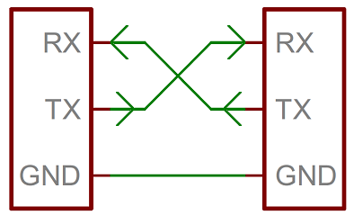
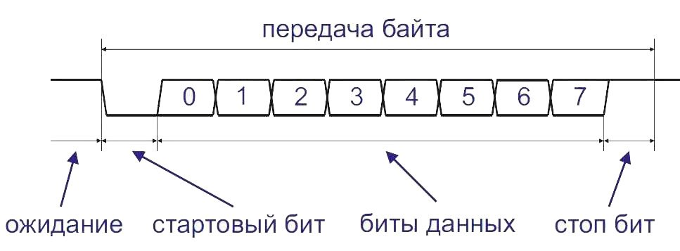

# Практическое применение RISC-V при программировании микроконтроллеров

[(Оглавление)](index.md)

# 4.UART

Это один из самых распространенных интерфейсов. Устроен он предельно просто: биты передаются по одному с равными, заранее заданными интервалами. Признаком начала передачи является стартовый бит - переход из "пассивного" уровня (лог.1) в "активный" (лог.0). После него идут 8 бит данных начиная с младшего. Далее может идти, а может и не идти бит четности, служащий для контроля целостности байта, и наконец, несколько (даже не всегда целое число) стоп-битов. Стоп-бит является переходом от состояния предыдущего бита к "пассивному" уровню. Передача осуществляется по линии TX, прием по линии RX и могут идти одновременно. Поэтому UART - трехпроводная линия: TX, RX и земля. Линия TX одного устройства соединяется с RX второго и наоборот. Нельзя соединять TX с TX. Соединять RX с RX можно, но бесполезно. Поскольку точность обмена целиком зависит от временных интервалов, требуется хорошее согласование частот передатчика и приемника. По-хорошему, тактирование от кварцевого резонатора, но практика показывает, что и у обычного RC-генератора, используемого по умолчанию контроллером, хватает для отладочных целей. Кроме того, существует ряд стандартных скоростей обмена вроде 9600 или 115200 бит в секунду. В случае Linux, посмотреть их можно в документации на termios.

Сам по себе UART обозначает только способ передачи данных и тайминги, но не уровни сигналов или разъемы. Это позволяет разводить линии UART непосредственно на плате для соединения периферии и использовать уровни, совпадающие с напряжением питания. Для GD32VF103 логическому 0 будет соответствовать 0 В, а логической 1 - +3.3 В.

Существует и вариация UART, предназначенная для соединения отдельных приборов - RS232, она же COM-порт. Отличие в логических уровнях (лог.0 = +5...+15 В, лог.1 = -5...-15 В), стандартном разъеме (DB9 или DB25) и наличии дополнительных управляющих выводов вроде готовности передатчика или наличия тонового сигнала.

Обозначение UART или USART говорит, что данный интерфейс может работать и в синхронном режиме. Правда, используется это довольно редко. Лично мне привычнее называть его именно UART, не вспоминая о синхронных возможностях.

## 4.1. Программирование UART

Как и в случае любой периферии, перед использованием на нее надо подать тактовый сигнал. В случае USART0 за нее отвечает бит RCU_APB2ENR_USART0EN. Кроме того, поскольку UART задействует ноги ввода-вывода для своей работы, их необходимо настроить так, чтобы значение GPIOx_OCTL ей не мешало. Этот режим называется Alternate-function и кодируется битами 0b1011. Впрочем, ножка входа (RX) используется только для чтения и с OCTL не конфликтует, поэтому ее оставляют в режиме Input. Также работу альтернативных функций необходимо разрешить выставлением бита RCU_APB2ENR_AFEN.

После этого настраивается режим работы модуля. Настройка заключается в разрешении работы модуля (бит USART_CTL0_UEN), разрешении передачи (бит USART_CTL0_TEN) и приема (бит USART_CTL0_REN). После этого выставляется скорость обмена. Она определяется регистром USART_BAUD, который содержит делитель тактовой частоты (на самом деле, частоты шины APB2, поскольку частота на разных шинах может отличаться). В документации приведена страшная формула, содержащая целую и дробную части этого делителя, но на практике достаточно записать туда просто частное от деления тактовой частоты на скорость обмена. После этого в регистр USART_DATA можно записывать байт для передачи. В этот же регистр попадет байт, принятый с другой стороны.

Скорость UART мы выставили в 9600 бод, тогда как скорость ядра составляет 8 МГц. Поэтому нельзя записывать в USART_DATA байты на максимальной скорости - надо дожидаться пока модуль очередной байт передаст. За это отвечает бит USART_STAT_TBE. Аналогично за прием байта отвечает бит USART_STAT_RBNE, который надо проверять чтобы определить был ли принят хоть один байт.

TLDR:
	
1. Разрешить тактирование UART и AF: биты  RCU_APB2ENR_USART0EN и  RCU_APB2ENR_AFEN.
2. Настроить выводы RX, TX на вход и альтернативный выход соответственно.
3. Разрешить работу UART, передатчика и приемника: биты USART_CTL0_UEN,  USART_CTL0_TEN и  USART_CTL0_REN.
4. Настроить скорость обмена: USART_BAUD как делитель тактовой частоты
5. Передача:
    1. Дождаться бита USART_STAT_TBE
    2. Записать новый байт в USART_DATA
6. Прием:
    1. Дождаться бита USART_STAT_RBNE
    2. Считать принятый байт из USART_DATA

## 4.2. Отладка при помощи UART

Самый простой способ отладки: на компьютере запускается **screen** или другая утилита для просмотра и передачи файлов через COM-порт, для нее указывается имя порта (обычно что-то вроде /dev/ttyUSB0) и скорость обмена (та же, что выставлена на устройстве). Далее компьютер и контроллер могут обмениваться обычными текстовыми строками. Удобно функции приема и передачи строк оформить в виде подпрограмм. Еще удобнее организовать буфер-очередь (FIFO), в который из основного кода писать (читать), а по прерываниям UART передавать данные через собственно интерфейс.

При использовании screen стоит помнить, что выйти из него не проще, чем из vim'а. Сначала нужно нажать ctrl+a, потом отпустить, и нажать k. Он выдаст запрос подтверждения выхода, и там надо нажать y. Еще раз: нажали ctrl, нажали a, отпустили a и ctrl, нажали k, отпустили k, нажали y, отпустили y. Подобным способом в screen вводятся и другие команды: переключение окон, разделение по вертикали и горизонтали и т.д. Очень удобно при подключении к удаленному компьютеру, когда доступ есть только по ssh.

Исходный код примера доступен [на github](https://github.com/KarakatitsaRISCV/riscv-asm/tree/main/4.interrupt)

## Д/З:

1. Оформить передачу и прием отдельного байта в виде подпрограммы uart_putc, uart_getc по аналогии с обычными putc, getc.
2. Можно ли сделать работу с UART неблокирующей (чтобы подпрограмма не ждала пока придет байт, а возвращала ошибку "байт не пришел")?
