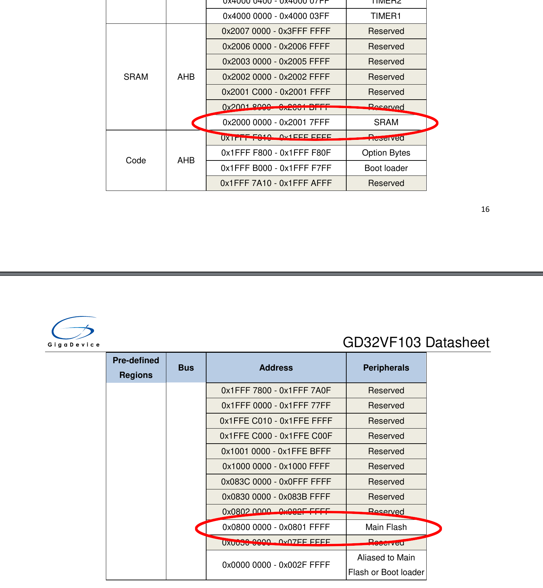
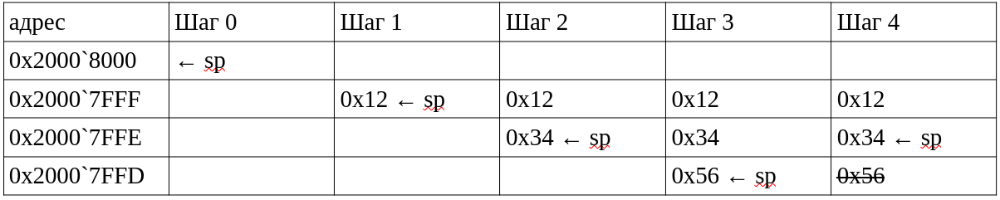

# Практическое применение RISC-V при программировании микроконтроллеров

[(Оглавление)](index.md)

## 5.1. Доделываем UART чтобы передавать строки

    uart_puts:
      li t0, USART0
    UART_PUTS_WAIT:               ; <─┬──┐
      lw t1, USART_STAT(t0)       ;   │  │
      andi t1, t1, USART_STAT_TBE ;   │  │
        beqz t1, UART_PUTS_WAIT   ; ──┘  │
      lb t1, 0(a0)                ;      │
      addi a0, a0, 1              ;      │
        beqz t1, UART_PUTS_END    ; ──┐  │
      sb t1, USART_DATA(t0)       ;   │  │
      j UART_PUTS_WAIT            ; ──┼──┘
    UART_PUTS_END:                ; <─┘
    ret

В данном коде строка передается через a0 и посимвольно выводится на UART. Поскольку данный интерфейс работает намного медленнее, чем ядро, приходится ждать передачи очередного байта и освобождения буфера. Для этого служит бит **TBE** *(transmit buffer empty)* регистра **STAT**. Как следует из названия, он взводится когда буфер пуст и готов к записи следующего байта.

Последовательность символов для передачи указывается подпрограмме при помощи регистра a0, как и положено по соглашению. Но где же хранить эту исходную строку? Казалось бы логичным использовать для этого сегмент данных **.data**, но в микроконтроллере строгое разделение по типам памяти, и **.data** располагается в оперативной памяти, которая сбрасывается при пропадании питания, а потом при старте не инициализируется. То есть при старте в ней будет лежать какой-то произвольный мусор. Простейший способ это обойти - использовать для хранения данных секцию кода, **.text**, как будто это не данные, а инструкции. Конечно, если туда перейдет управление и начнет выполнять наши строки, будет неприятно. Ну, значит, надо внимательнее следить за кодом.

Другой вариант - инициализировать оперативную память вручную. Для этого напишем код вывода шестнадцатеричного числа. В памяти будет выделен буфер на 9 байт (8 цифр плюс терминирующий ноль), который будет последовательно заполняться, а после заполнение передаваться подпрограмме uart_puts для вывода.

    .data
    UART_PUT_BUF: .space 9
    .text
    uart_putx:
      la t0, UART_PUT_BUF
      sb zero, 8(t0)
      li t1, 28
    UART_PUTX_LOOP:
      srl t2, a0, t1
      andi t2, t2, 0xF
      addi t3, t2, -10
        bltz t3, UART_PUTX_09
      addi t2, t3, 'A'-'0'
    UART_PUTX_09:
      addi t2, t2, '0'
      sb t2, 0(t0)
      addi t0, t0, 1
      addi t1, t1, -4
        bgez t1, UART_PUTX_LOOP
      la a0, UART_PUT_BUF
    j uart_puts
    
Но это все полумеры, нужно найти способ где-то хранить начальные данные, а при старте копировать их в оперативную память.

## 5.2. Адреса и размеры сегментов

Такой способ, разумеется, есть, и чтобы им воспользоваться, рассмотрим устройство памяти нашего контроллера. В даташите приведены диапазоны адресов, отвечающих за флеш (0x0800'0000 - 0x0801'FFFF) и оперативную память (0x2000'0000 - 0x2001'7FFF). Нижняя граница одинакова для всех контроллеров, а вот верхняя зависит от реально доступного объема. В случае GD32VF103CBT6 это 128 кБ флеш и 32 кБ ОЗУ. 

Чтобы не прописывать эти числа каждый раз в коде, придуман специальный файл с настройками компоновщика (linker), специальной программы, которая из него читает адреса и записывает соответствующие секции по ним. Этот файл специфичен для каждого контроллера и называться будет в нашем случае **gd32vf103cbt6.ld**. Подключается он в случае gcc ключом -T.

    MEMORY{
        flash (rxai!w) : ORIGIN = 0x00000000, LENGTH = 128K
        ram (wxa!ri) : ORIGIN = 0x20000000, LENGTH = 32K
    }
    
    SECTIONS{
      .text : {
        *(.text*)
        *(.rodata*)
        . = ALIGN(4);
      } > flash
      
      .data : AT(ADDR(.text) + SIZEOF(.text)){
        _data_start = .;
        *(.data*)
        . = ALIGN(4);
        _data_end = .;
      } > ram
      
      .bss : {
        _bss_start = .;
        *(.bss*)
        . = ALIGN(4);
        _bss_end = .;
      } > ram
    }

    PROVIDE(_stack_end = ORIGIN(ram) + LENGTH(ram));
    PROVIDE(_data_load = LOADADDR(.data));
	
Здесь стоит отметить в первую очередь, что флеш начинается не с 0x0800'0000, а с 0x00000000. Дело в том, что при старте контроллера в зависимости от перемычек BOOT0, BOOT1 на нулевой адрес может отображаться флеш, оперативная память или загрузчик. Само собой, что в рабочем режиме там будет именно флеш, то есть одни и те же данные будут доступны как по адресу 0x0000'0000, так и 0x0800'0000. Собственно, именно этой особенностью я и пользуюсь при прошивке: отображаю на нулевой адрес начало загрузчика, перезагружаю контроллер, прошиваю, снова переключаю на нулевой адрес основной код и снова перезагружаю.

Вторая важная вещь из содержимого файла не очевидна, но секция **.data** содержится не только в оперативной памяти, но в во флеш, правда тайно - отдельного сегмента под нее там не отводится, и даже дизассемблированием ее просто так не получить. Тем не менее, из кода до нее добраться просто, по адресу **_data_load**. А вот объем не хранится нигде. Да он и не нужен, поскольку есть адреса начала и конца секции **.data** в оперативной памяти: **_data_start** и **_data_end**. Поэтому копирование данных из **_data_load** в **_data_start** можно вести пока не дойдем до адреса **_data_end** оперативки (не флеш!). Впрочем, при сильном желании данные **.data** можно найти и в бинарном файле, достаточно дизассемблировать именно бираник (не эльфа), чтобы проигнорировать размещение по сегментам:

    riscv64-unknown-elf-objdump -m riscv -b binary -D -S res/firmware.bin > res/firmware.lss

Третья вещь - наличие кучи посторонних секций. Секция .rodata отвечает за константные данные, read-only data, расположенные во флеш-памяти. Для ассемблера это не слишком критично: программист может и прямо в **.text** писать, но компиляторы придерживаются более строгих соглашений и переменные, помеченные как const, размещают именно там. Секция **.bss** (*Block Started by Symbol*, что бы это ни значило) отвечает за хранение неинициализированных глобальных и статических переменных, начальное значение которых никому не нужно. В случае ассемблера это действительно так, и обнулять **.bss** не обязательно, но для языков высокого уровня опять накладываются более строгие ограничения. Тот же Си требует, чтобы значения всех неинициализированных глобальных данных было обнулено. Вероятно, этого требуют соображения безопасности. Мало ли какое на какие байты попадет переменная указателя, которую невнимательный программист забудет инициализировать. А потом будет читать или писать в непонятное место. В случае же нулевого значения, чтение по адресу NULL заканчивается закономерной и воспроизводимой ошибкой segfault. В нашем случае - исключением по доступу к памяти, о котором будем говорить в следующий раз. В случае наличия операционной системы, занулением **.bss** может заниматься она, чтобы программа случайно не получила доступ к данным той, что выполнялась на том же месте до нее.

Ну и четвертое - адрес **_stack_end**, указывающий, как несложно догадаться, на конец доступной памяти, то есть тот самый адрес, от которого растет стек.

Теперь, зная все это, можно написать код подготовки памяти: инициализировать **sp**, скопировать данные из **_data_load** в секцию **.data** и обнулить секцию **.bss**. После этого строка из **.data** будет выводиться не менее корректно, чем объявленная в **.text** или **.rodata**. Ну и стеком наконец-то можно будет пользоваться.

## 5.3. Стек

Кстати о стеке. Это такая сруктура данных поверх обычной оперативной памяти, которая позволяет последовательно складывать туда любое количество данных, а потом не менее последовательно снимать. В простейшем случае она используется для вложенного вызова функций. То есть функция поработала-поработала, сложила какие-то нужные данные на стек и вызвала другую функцию. Та ничего не знает про предыдущие данные и кладет на свободное место свои. Поработала-поработала, очистила свои данные и вернула управление предыдущей функции. Физически это организовано довольно просто: память выделяется от конца операивной памяти вниз. Текущий указатель конца стека хранится в специальном регистре sp. Теоретически, можно и в любом другом, но если одна процедура будет пользоваться одним регистром, другая другим, рано или поздно все запутаются. Для простоты рассмотрим стек из 100 байтов, и sp = 100. Соответственно, когда функция хочет положить, скажем, 10 байт на стек, она сначала резервирует масто, сдвигая sp на 10 байт вниз (sp = 90), а потом записывает данные по адресам от sp+0 до sp+9, то есть от 90 до 99. Если она вызывает следующую функцию, ей достается уже уменьшенный sp. Допустим, она выделяет еще 4 байта (sp = 86, доступная память от 86 до 89) и что-то с ними делает. Когда функция завершается, она сдвигает sp обратно в то значение, в котором он ей пришел. Сами данные она за собой практически никогда не чистит.

В нашем контроллере оперативная память начинается с 0x2000 0000 и заканчивается на 0x2000 8000. Еще раз проиллюстрировать работу со стеком можно так:

Еще раз обратите внимание, что после снятия со стека, данные никуда не деваются, просто считаются мусором и могут быть перезаписаны другой подпрограммой.

В реальности на стеке обычно хранится содержимое каких-либо регистров. Напоминаю, согласно соглашениям RISC-V часть регистров должны безболезненно переживать вызов подпрограммы (s0-s11), а часть могут быть испорчены (t0-t6, a0-a7). Соответственно, если программа хочет внутри себя воспользоваться каким-нибудь s3, s8 и s11, она должна сначала сохранить их на стеке, попользоваться, а потом - прочитать обратно. В коде это может выглядеть приблизительно так:

    some_func:
      addi sp, sp, -12
      sw s3, 0(sp)
      sw s8, 4(sp)
      sw s11,8(sp)
      ...
      что-то делаем
      ...
      lw s11,8(sp)
      lw s8, 4(sp)
      lw s3, 0(sp)
      addi sp, sp, 12
      ret

Также не забываем, что в ra хранится наш адрес возврата, и если планируется с этим регистром что-то делать (например, вызывать другие функции), его тоже придется сохранить.

В порядке извращения я набросал макросы push и pop для произвольного количества регистров, авось пригодятся.

    .macro push regs:vararg
      .equ _pushpop_cnt, 0
      .irp idx, \regs
        .equ _pushpop_cnt, (_pushpop_cnt-4)
      .endr
      addi sp, sp, _pushpop_cnt
      .irp idx, \regs
        .equ _pushpop_cnt, (_pushpop_cnt+4)
        sw \idx, -_pushpop_cnt(sp)
      .endr
    .endm
    
    .macro pop regs:vararg
      .equ _pushpop_cnt, 0
      .irp idx, \regs
        .equ _pushpop_cnt, (_pushpop_cnt-4)
      .endr
      .equ _pushpop_cnt2, _pushpop_cnt
      .irp idx, \regs
        .equ _pushpop_cnt, (_pushpop_cnt+4)
        lw \idx, -_pushpop_cnt(sp)
      .endr
      addi sp, sp, -_pushpop_cnt2
    .endm
	
Исходный код примера доступен [на github](https://github.com/KarakatitsaRISCV/riscv-asm/tree/main/3.memory)

## Д/З:

1. Проверить адреса всех сегментов памяти. Когда мы тестировали на другом компиляторе, тот пытался разместить данные из .text по адресам 0x2000'0000 (в оперативной памяти) или обращаться к ним через GOT/PLT. В контроллере ничего этого не нужно и будет только мешать. Надо убедиться, что на вашем компиляторе все настроено правильно.
2. В дополнение к написанной подпрограмме uart_putx написать вывод знакового целого uart_puti. Хорошо, если получится сделать это без ведущих нулей: 0000007296 плохо, 7296 хорошо.
3. Дописать ввод знаковых, шестнадцатеричных чисел и строк: uart_geti, uart_getx, uart_gets
4. Дописать макросы работы со стеком, чтобы помимо сохранения регистров резервировали заданное количество байт ближе к вершине. Например, push 10, s0, t1, a2 должен сдвинуть sp на (10+4+4+4=) 22 байта, положить s0 в (sp+18), t1 в (sp+14), a2 в (sp+10), а байты (sp+0 ... sp+9) оставить свободными. Под локальные переменные или что-нибудь еще. Аналогично должен работать pop.
