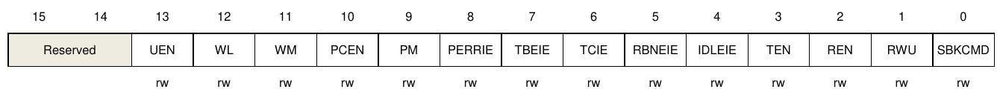
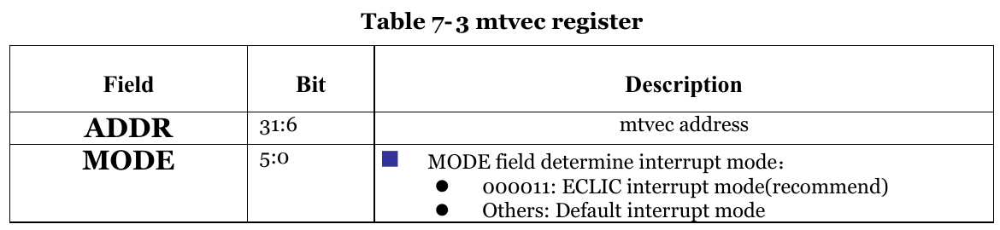

# Практическое применение RISC-V при программировании микроконтроллеров

[(Оглавление)](index.md)

# 6. Прерывания

Как уже неоднократно говорилось, специфика микроконтроллеров заключается в их скорости реакции на внешние события и большом разнообразии подключаемой периферии при малой сложности вычислений. Чтобы повысить скорость реакции, можно чаще проверять биты статуса, но это существенно усложнит написание программ и замедлит выполнение. А начиная с некоторого количества периферии, вообще наступит физический предел: на опрос всех битов уйдет больше времени, чем допустимо в устройстве. Чтобы обойти этот предел, для проверки битов придумали использовать не программный код, а аппаратный модуль - контроллер прерываний. Его задача заключается в том, чтобы отловить факт возникновения события, удостовериться, что данное событие разработчику интересно и что контроллер в данный момент готов его обрабатывать. После этого выполнение основного кода приостанавливается (прерывается), а управление передается на специальную подпрограмму - обработчик прерывания.

Для перехода на обработчик прерывания должны быть выполнены все связанные с ним условия:

- Прерывание от данного события должно быть разрешено. Если в устройстве используется только UART, возникновение прерываний от всяких таймеров нам не интересно. Более того, некоторые устройства (в основном, ножки ввода-вывода) генерируют прерывания не импульсно (один раз на событие), а непрерывно. Например, все время пока на ножке высокий уровень. Без возможности запрета таких прерываний контроллер будет постоянно висеть в обработчике.
- Прерывание должно быть разрешено глобально. Дело в том, что некоторые группы команд прерывать нельзя - собьются тайминги, возникнут нежелаельные импульсы или что-то в этом роде. Такие операции называются атомарными (неделимыми) и в простейшем случае реализуются именно сбросом глобального разрешения прерываний и его последующим восстановлением. Также глобальное разрешение сбрасывается при заходе в прерывание, чтобы не было циклической обработки.
- Контроллер прерываний вообще-то должен быть настроен. Выставлен адрес обработчика, разрешения и т.п.
- При наличии системы приоритетов прерываний (в некоторых контроллерах, например AVR, ее нет, но в нашем gd32vf103 - есть, хотя работать с ней мы пока не будем) приоритет пытающегося запуститься прерывания должен быть выше того, что обрабатывается сейчас. "Приоритет" основного кода, естественно, ниже, чем у любого прерывания. Таким способом можно обойти предыдущий пункт и все-таки реализовать обработку прерывания в обработчике прерывания.

Поскольку прерывания генерируются внешними устройствами и не привязаны к выполняющейся в данный конкретный момент инструкции, обработчик обязан после завершения работы вернуть контроллер ровно в то же состояние, что было до его вызова. Это значит восстановить **все** регистры, включая временные, регистр возврата ra, стек. В случае архитектур с регистрами флагов (к RISC-V это не относится) - и их тоже. При этом возникает два очевидных вопроса:

Как писать код, если все регистры заняты? В общем-то, примерно так же, как и для обычных подпрограмм: нужные регистры сохраняются на стеке, а перед выходом из обработчика восстанавливаются. В простейшем случае (на котором мы остановимся) стек будет общий как для пользовательского кода, так и для прерываний. Но вообще-то RISC-V поддерживает переключение стеков при смене привилений. Скажем, основной код выполняется в U-mode (пользовательский с низкими привилегиями), а прерывания - в M-mode (машинный уровень с максимальными привилегиями). Для этого служит интересный CSR регистр mscratchcsw, но его мы проверить не сможем, пока не доберемся до режимов работы контроллера.

Откуда брать адрес возврата из прерывания, если ra использовать нельзя? Для этого существует специальный CSR-регистр **mepc**. Возврат по его значению осуществляется специальной инструкцией **mret**. Помимо прочего она умеет переключать уровни привилегий, если контроллер настроен правильно.

## 6.1. ECLIC и его настройка

Контроллер прерываний в нашем микроконтроллере называется ECLIC (Enhanced Core Local Interrupt Controller). Управляется он частично через CSR-регистры, частично через MMIO. Регистры у него следующие:

| регистр       | размер | смещение     | описание |
|---------------|--------|--------------|----------|
|cliccfg        |  4(8)  |   0x0        | Глобальные настройки приоритетов |
|clicinfo       |  25(32)|   0x4        | Разнообразная информация о прерываниях конкретного контроллера |
|mth            |  8(8)  |   0xB        | Порог срабатывания прерываний |
|clicintip[i]   |  1(8)  | 0x1000+4*i | Флаг ожидающего прерывания |
|clicintie[i]   |  1(8)  | 0x1001+4*i | Флаг разрешения прерывания |
|clicintattr[i] |  3(8)  | 0x1002+4*i | Настрока фронта прерывания и режим |
|clicintctl[i]  |  8(8)  | 0x1003+4*i | Приоритет |

Тут же встает вопрос относительно чего расчитывается смещение и где про это написано. И тут у меня ответа к сожалению нет: я не нашел упоминаний этого адреса ни в одной документации. Только изучая примеры кода от производителя, был обнаружен **базовый адрес 0xD200'0000.**

Регистры **clicintip**, **clicintie**, **clicintattr** и **clicintctl** привязаны каждый к своему прерыванию, поэтому и объединены в массив. В нашем случае используется прерывание от USART0, за которым производителем закреплен номер 56, соответственно использоваться будут **clicintip[56]**, **clicintie[56]**, **clicintattr[56]** и **clicintctl[56]** с адресами (0x1000 + 4*56 =) 0x10E0, 0x10E1, 0x10E2 и 0x10E3. Посмотреть номера и список всех доступных в данном конкретном контроллере прерываний можно в его User Manual'е в разделе, посвященном прерываниям. В нашем случае это здоровенная табличка из 86 элементов.

Немного расшифрую что написано в таблице. Регистр **mth**: я пока точно не знаю за что он отвечает, поэтому подробностей не будет, изучайте документацию. Регистр **clicintip** содержит всего один значащий бит. Если прерывание уже готово выполниться, он выставляется в 1, что, при выполнении остальных условий, приводит к собственно переходу на прерывание. Насколько я понял, он оставлен только для совместимости со старыми версиями контроллеров векторов прерываний и в ECLIC практически не используется. Регистр **clicattr**: некоторая периферия (особенно ножки ввода-вывода GPIO) умеют генерировать прерывание по высокому уровню (все время пока на ножке лог.1 будет вызываться прерывание), по нарастающему фронту (лог.0 -> лог.1) и по спадающему фронту (лог.1 -> лог.0). Для большей же части периферии эта настройка бесполезна. Что такое режим (векторный / не-векторный) рассмотрим чуть позже.

Собственно настройка ECLIC для простейшего случая работы с прерываниями сводится всего лишь к разрешению прерываний от интересующей нас периферии, то есть выставлении **clicintie[56]** в **1**:

    li t0, ECLIC_CLICINT
      li t1, 1
    sb t1, (ECLIC_CLICINTIE + 4*USART_IRQn)(t0)
    
Обратите внимание, что для записи использована инструкция **sb**: размер регистров 8 бит, и трогать соседние мы не хотим.

## 6.2. Настрока периферии

Периферии мы пока изучили немного, поэтому работать будем с UART. Как мы уже выяснили, за все события, происходящие с UART'ом отвечает одно прерывание, с номером 56. Самих же событий может быть несколько, и прописаны они в регистре **USART_CTL0**:

**PERRIE**, Parity error interrupt enable - прерывание по ошибке приема. У UART есть простенькая система защиты от сбоев при обмене, и это прерывание возникает при ее срабатывании.

**TBEIE**, Transmitter buffer empty interrupt enable - прерывание по опустошению буфера передачи

**TCIE**, Transmission complete interrupt enable - прерывание по фактическому окончанию передачи

**RBNEIE**, Read data buffer not empty interrupt and overrun error interrupt enable - прерывание по приему байта

**IDLEIE**, IDLE line detected interrupt enable - прерывание по таймауту. Если данные не приходили слишком долго.

Продемонстрировать работу прерываний будет проще всего на передаче. Контроллер передаст байт, после чего должно произойти событие и мы окажемся в обработчике. Но в регистре USART_CTL0 этих прерываний два. Дело в том, что передача байта происходит в два этапа: сначала байт записывается в USART_DATA, потом автоматически копируется во внутренний буфер, из которого бит за битом передается в линию TX. И пока он передается, в регистр USART_DATA можно положить еще один байт, он там будет лежать, пока предыдущий не освоболит место во внутреннем регистре. Так вот, прерывание **TBEIE** возникает когда байт покинул регистр USART_DATA и **начал** передаваться. А **TCIE** - когда покинул внутренний регистр, и **передача полностью завершилась**. Соответственно, **TBEIE** надо использовать когда передаются байт за байтом, чтобы не было задержки между фактическим окончанием передачи, пока отработает прерывание, пока положат следующий байт и т.д. А **TCIE** - когда надо отключить модуль UART, то есть дождаться фактического окончания передачи. Поскольку отключать UART мы не будем, воспользуемся **TBEIE**б его нужно добавить к прочим флагам USART_CTL0.

## 6.3. Настройка контроллера

Итак, модуль ECLIC мы настроили, периферию настроили. Осталось написать собственно обработчик прерывания, положить его адрес в какой-нибудь регистр и разрешить прерывания глобально. Начнем, как ни странно, с регистра хранения адреса обработчика, **mtvec**:

Как видно из таблицы, младшие 6 битов отвечают за режим работы. Нас интересует режим ECLIC, которому соответствует комбинация 0b000011. Но из-за аж шести занятых битов, данный регистр не может хранить шесть младших битов адреса. Поэтому придется обработчик прерывания располагать с выравниванием на 64:

    .text
    .align 6
    trap_entry:
      push t0, t1, a0, ra
      
      li t0, GPIOB
      lh t1, GPIO_OCTL(t0)
        xori t1, t1, (1<<GLED)
      sh t1, GPIO_OCTL(t0)
      
      li a0, 1000000
      call sleep
      
      pop t0, t1, a0, ra
    mret
    
Из кода довольно очевидно, что прерывание всего лишь мигает зеленым светодиодом и возвращается по адресу **mepc** при помощи команды **mret**. Вот именно адрес этой подпрограммы надо записать в **mtvec**:

    la t0, trap_entry
      ori t0, t0, 0b000011
    csrw mtvec, t0
    
И разрешить прерывания глобально. Очевидно, что делать это надо когда периферия и прерывания уже настроены, то есть обычно перед бесконечным рабочим циклом. За глобальное разрешение прерываний отвечает регистр **mstatus**, а точнее его бит **MIE**:

    csrs mstatus, (1<<3)
    
Вот теперь прерывание работает: после выполнения кода передачи строки начинает мигать зеленый светодиод, а управление в основную программу не возвращается. В чем дело?

В том, что с прерыванием мы ничего не сделали: оно как ждало обработки, так и продолжает ждать. Вот и тыкается в обработчик в надежде, что хоть теперь его обработают. Но полноценно мы его обрабатывать пока не будем, просто скажем *"хорошо, мы поняли, что данные переданы, можешь больше не следить за UART'ом"*. То есть просто запретим данное прерывание:

    li t0, USART0
    li t1, USART_CTL0_UEN | USART_CTL0_REN | USART_CTL0_TEN
      sw t1, USART_CTL0(t0)
    li t1, '+'
      sw t1, USART_DATA(t0)
      
...ну и плюсик выведем, почему бы и нет. Вот теперь прерывание работает правильно: срабатывает, отключает само себя и возвращает управление основному коду.

## 6.4. Исключения

В микроконтроллерах источником неожиданных событий почти всегда оказывается именно периферия. Но в компьютерах, где программы куда больше и сложнее, чаще бывают и чисто программные ошибки. Плюс при наличии операционной системы появляется и необходимость к ней обращаться из пространства пользователя. Эти задачи также решаются контроллером прерываний. Тут я сразу вынужден уточнить терминологию: **прерывания** это события от внешних устройств; **исключения** - от выполнения определенных инструкций кода; **исключительные ситуации** - от обоих. Разница в том, что прерывание возникает когда ему хочется, и к коду не привязано. Поэтому после обработки надо вернуться в то же самое место, на котором оно случилось. Исключение же возникает в строго отведенных местах: код попытался выполнить несуществующую инструкцию; попытался обратиться к недоступному адресу; попытался работать с невыровненными данными (кстати, наш контроллер к невыровненным данным равнодушен, и ошибок не выдает); попытался сделать системный вызов. Следовательно, при обработке исключений надо сначала определиться что же собственно произошло - штатное событие или ошибка. Если ошибка, то можно ли ее обработать или лучше прибить процесс, пока хуже не стало.

Для примера напишем три инструкции, приводящие к исключениям:

    .word 0xFFFFFFFF # несуществующая инструкция
    ecall # системный вызов
    ebreak # точка останова
    
При выполнении такого кода контроллер начинает яростно мигать зеленым светодиодом и спамить плюсики в UART. Логично, ведь при выполнении инструкции **0xFFFFFFFF** возникает исключительная ситуация, обрабатывается нашим **trap_entry**, после чего управление передается опять на **0xFFFFFFFF**. Что снова приводит к исключению.

В первую очередь надо отделить исключения от прерываний. Для этого служит регистр **mcause**, а точнее, его 31-й бит. Если он сброшен в 0, то перед нами исключение, а если выставлен в 1 - прерывание. Соответственно обработчик прерываний остается неизменным, но при обнаружении нуля в 31-м бите **mcause** надо перейти на обработчик исключения. Отличаться он будет тем, что мигать в нем будем красным диодом, а возвращаться не на ту же инструкцию, которая привела к исключению, а на следующую. Просто-напросто считаем **mepc**, увеличим на 4 (размер инструкции) и запишем обратно:

    csrr t0, mepc
      addi t0, t0, 4
    csrw mepc, t0
    
Но тут из-под воды возникают интересные грабли: контроллер наш поддерживает расширение **C** (Compressed) - сжатые инструкции. То есть часть инструкций у него 32-битная, а часть - 16-битная. А перепрыгивать 16-битную инструкцию через 4 байта это плохая идея. К счастью, разработчики RISC-V предусмотрели замечательный способ определить длину инструкции. У 32-битных два младших бита всегда равны 0b11, а в 16-битных - любому другому числу. То есть нам надо всего лишь проверить эти два бита и в зависимости от этого решить, прибавлять 4 или все же 2:

    csrr t0, mepc
    lhu t1, 0(t0)
      andi t1, t1, 0b11
      addi t1, t1, -3
      bnez t1, TRAP_INSTR_COMPR
        addi t0, t0, 2
    TRAP_INSTR_COMPR:
      addi t0, t0, 2
      csrw mepc, t0
      
Как я говорил в самом начале, исключения в контроллерах используются достаточно редко, поэтому пока на этом и остановимся.

## 6.5. Разделение прерываний и исключений

Но если исключения штука редкая, но возможная, можно ли убрать проверку **mcause** из обработчика прерываний? Оказывается, можно. Для этого используется еще один CSR-регистр **mtvt2**, который в стандарт RISC-V не входит, и является специфичным для нашего контроллера. Его младший бит отвечает за то, использоать ли его вообще, а оставшиеся биты хранят адрес обработчика прерываний. То есть в **mtvec** будет адрес обработчика исключений, а в **mtvt2** - прерываний:

    .equ mtvt2, 0x7EC
    ...
    la t0, irq_entry
      ori t0, t0, 1
    csrw mtvt2, t0
    
Естественно, раз уж обработчиков теперь стало два, нужно каждый из них оформить как обработчик - персональная точка входа, работа со стеком, mret.

## 6.6. Векторный режим

Специфика контроллера вынуждает пойти еще дальше и вместо одного обработчика на все прерывания, в котором нужно было анализировать младшие биты **mcause** чтобы выяснить какое именно устройство вызвало прерывание, был придуман еще более хитрый механизм. Он заключается в том, что для каждого устройства пишут свой, персональный обработчик прерывания, а их адреса (иногда - прямо команды перехода по адресам) сводят в специальную таблицу - таблицу векторов прерываний. Например, если нас интересует 56-е прерывание, то в 56-ю ячейку надо записать адрес обработчика. Как и с отдельными обработчиками, для хранения адреса таблицы выделен отдельный CSR-регистр **mtvt**. Причем работа с таблицей реализована очень разумно: в регистре хранится старшая часть адреса таблицы, а вместо младшей подставляется номер прерывания. То есть если адрес самой таблицы равен **0x2000'1000** (где-то в оперативной памяти), и произошло прерывание 56 (поскольку инструкция 4-байтная, то смещение будет 224, оно же **0x0000'00E0**), то адрес будет взят из ячейки (**0x2000'1**000 OR 0x0000'0**0E0**) = **0x2000'10E0**. Из этой реализации следует ограничение на выравнивание таблицы. В нашем случае, когда прерываний 86, фактический размер таблицы составляет 344 байта, что помещается в 512-байтную область. Это соответствует выравниванию *.align 9*.

Здесь надо не забыть, что векторный / не-векторный режим настраивается в регистре **clicattr[i]**, причем для каждого прерывания независимо.

    la t0, vector_table
    csrw mtvt, t0
    ...
    li t0, ECLIC_CLICINT
      li t1, 1
    sb t1, (ECLIC_CLICINTIE + 4*USART_IRQn)(t0)
    sb t1, (ECLIC_CLICINTATTR+4*USART_IRQn)(t0)
    
Прописывать простыню из 86 адресов прерываний я здесь не буду, кому интересно может посмотреть в примерах кода.
    
Вот теперь мы познакомились со всеми основными способами обработки исключительных ситуаций, и можем выбирать тот или иной в зависимости от задач. **Не стоит думать будто невекторный режим является устаревшим, просто для разных задач оптимальными будут разные подходы.**

## 6.7. Расположение таблицы векторов прерываний

Как мы увидели раньше, расположить ее можно где угодно, лишь бы выравнивание соблюдалось. Можно даже хранить несколько таблиц по разным адресам и переключать их по желанию левой пятки. Но проще всего все же выделить для таблицы постоянное место - в начале прошивки. Мы ведь точно знаем, что адрес **0x0000'0000** (и даже реальный адрес **0x0800'0000**) совершенно точно выровнены по 512-байтной границе. Разработчики даже сделали нам подарок, не став использовать 0-й адрес вектора прерываний, на который попадает управление при старте контроллера. В него можно записать безусловный переход на начало основного кода. Ну а чтобы таблица располагалась именно там, где надо, для нее можно выделить специальную секцию памяти, а в *.ld файле указать, что размещается она в самом начале.

## 6.8. Системные вызовы

Теперь, когда с самой сложной частью закончили, можно вернуься к исключениям. Например, реализовать системные вызовы из стандарта RARS вроде ввода-вывода чисел, строк, символов и прочего.

Как говорит нам документация, причина исключения хранится в младших 12 битах регистра **mcause**. За выполнением ecall зарезервировано два кода: 11 (если вызов произошел на M-mode) и 4 (если на U-mode). Пока что будем обрабатывать только ecall, а остальные исключения игнорировать.

Номер **ecall**'а хранится в регистра a7, и из списка вызовов RARS'а (напоминаю, в других средах системные вызовы другие!) нас интересуют 1 и 4 - вывод числа и вывод строки. Вот так может выглядеть обработчик исключений, поддерживающий эти два системных вызова:

    .text
    .align 6
    trap_entry:
      push t0, t1, ra
      
      csrr t0, mcause
      andi t0, t0, 0x7FF
      addi t1, t0, -11
        beqz t1, TRAP_ECALL
      addi t1, t0, -8
        beqz t1, TRAP_ECALL
      j TRAP_END
      
    TRAP_ECALL:
      addi t0, a7, -1
        bnez t0, TRAP_SKIP_PUTI
      call uart_putx
      j TRAP_END
    TRAP_SKIP_PUTI:
      addi t0, a7, -4
        bnez t0, TRAP_SKIP_PUTS
      call uart_puts
      j TRAP_END
    TRAP_SKIP_PUTS:
    
    TRAP_END:
      
      li t0, GPIOB
      lh t1, GPIO_OCTL(t0)
        xori t1, t1, (1<<RLED)
      sh t1, GPIO_OCTL(t0)
      
      csrr t0, mepc
      lh t1, 0(t0)
      andi t1, t1, 0b11
      addi t1, t1, -3
      bnez t1, TRAP_INSTR_COMPR
        addi t0, t0, 2
    TRAP_INSTR_COMPR:
      addi t0, t0, 2
      
      csrw mepc, t0
      
      pop t0, t1, ra
    mret
    
В результате наконец-то начали корректно работать участки кода

    li a0, 0x321
    li a7, 1
    ecall
    
    la a0, ECALL_STR
    li a7, 4
    ecall

## Заключение

Вот так в микроконтроллер gd32vf103 настраиваются прерывания и исключения. Возможно, на таком простом примере, как UART, их польза не очевидна, но желающие могут изучить и другую периферию, поработать через polling и прерывания и оценить, что выгоднее для их задачи. Это, кстати, не шутка: не надо пихать прерывания куда попало, в ряде случаев именно опрос регистра является оптимальным решением.

Исходный код примера доступен [на github](https://github.com/KarakatitsaRISCV/riscv-asm/tree/main/4.interrupt)

### Д/З

1. Реализовать полноценную работу с UART через прерывания - неблокирующий вывод и ввод строки. То есть функция uart_puts только копирует строку во внутренний буфер UART и разрешает передачу, после чего возвращает управление в основной код. И пока модуль UART медленно и печально передает байтики, основной код как ни в чем не бывало работает.
2. Реализовать еще несколько системных вызовов (ecall). Хотя бы вывод знакового целого числа в десятичном (а не шестнадцатеричном, как в примере) формате, ввод - вывод символа и т.п.
3. Реализовать прерывание по приему байта по UART (за это отвечает бит **RBNEIE**)