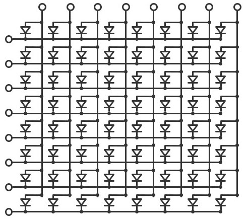
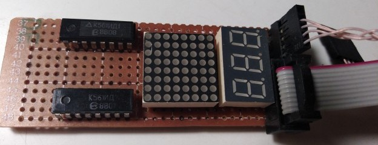
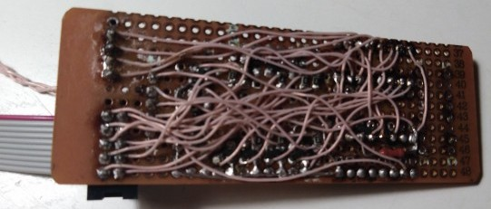
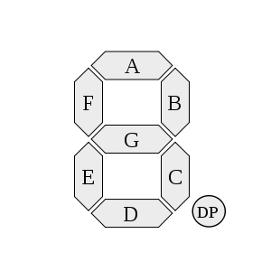

# Практическое применение RISC-V при программировании микроконтроллеров

[(Оглавление)](index.md)

# 8. Матричная организация периферия

Иногда возникает необходимость подключать к микроконтроллеру большое количество кнопок или индикаторов. Самые банальные примеры - клавиатура и дисплей. Причем количество элементов в такой периферии обычно значительно превышает количество выводов контроллера. 

Наиболее очевидное решение, это так называемые расширители портов - специальные микросхемы (или обычные сдвиговые регистры), преобразующие последовательный интерфейс вроде SPI или I2C в параллельный. Но это лишние корпуса и лишние соединения. Более простой способ - матричное соединение, когда отдельные кнопки или светодиоды располагаются прямоугольником, и для их активации нужно одновременно подать управляющий сигнал как на строку, так и на столбец.

Например, 16 кнопок можно организовать квадратом 4х4, что даст всего 8 линий. А дисплей из 64 светодиодов потребует 16.



Очевидным недостатком такого подключения является необходимость регулярно и довольно часто обновлять состояние элементов. Нельзя, как с отдельным светодиодом, выставить логический уровень, и забыть. Впрочем, эту проблему мы попробуем решить в следующий раз.

## 8.1 Клавиатура

Простейшую клавиатуру можно соорудить хоть на куске фанеры, натянув проводнички крест-накрест и замыкая их пальцем. Естественно, что ни удобством, ни надежностью такая конструкция отличаться не будет. Впрочем, на ней вполне можно экспериментировать и находить подводные камни.

Исходя из описанного ранее алгоритма работы с подобной периферией, рассмотрим опрос клавиатуры. Одна группа проводников будет линиями адреса - на них всех должен быть неакивный логической уровень, кроме одного, на котором будет активный, и который будет определять с какой же группой кнопок мы хотим работать. А вторая группа - линии данных, работа с ними ведется со всеми одновременно, с них мы считываем состояния нажатых кнопок во "включенной" группе.

С настройками линии данных особых проблем нет: очевидно, что раз они предназначены для чтения, настроены они должны быть на вход. Вот только если ни одна из кнопок не нажата, то линия висит в воздухе и не имеет фиксированного потенциала. Чтобы это исправить, линию нужно подтянуть к земле или питанию при помощи резисторов. Логический уровень на адресной линии в любом случае "пересилит" подтяжку, но пока кнопки отпущены, она успешно противостоит помехам. К счастью, напаивать резисторы на плату или фанерку необходимости нет: выводы контроллера могут работать в режиме входа с подтяжкой. Более того, в **GD32VF103** подтяжка может работать как к земле, так и к питанию, тогда как в некоторых других (например, в AVR) - только к питанию. Но для наглядности подтягивать будем к земле, чтобы нажатая клавиша соответствовала логической 1.

Настройка линий адреса чуть сложнее. Мы ведь не можем заранее предсказать какие кнопки и в каком порядке нажмет пользователь. Вдруг вообще все? Если сделать активный уровень лог.1, а неактивный - лог.0, то через две соседних кнопки можно легко получить короткое замыкание и, если не повезет, пожечь порты. Чтобы этого избежать, активный уровень оставим лог.1, а неактивный - режимом высокоомного входа, HI-Z.

Еще один неочевидный момент - скорость срабатывания. По сравнению с соединениями внутри кристалла, провода от ножек до кнопок весьма длинные, а следовательно, обладают какой-никакой емкостью. То есть требуют время на перезарядку. И дело еще усугубляется высокой скоростью работы самого контроллера. Сразу при старте это 8 МГц, но можно разогнать и до 108 МГц, это 9 наносекунд. Собственно, никто не гарантирует даже что сами порты успеют с такой скоростью отработать, не то чтобы внешняя обвязка. Собственно, именно за скорость срабатывания аппаратного обеспечения портов отвечают биты настройки скорости 2, 10 или 50 МГц - ядро-то может дергать их как хочет. Поэтому после выставления нового адреса и перед чтением состояния стоит добавить какую-то задержку. Точная величина не слишком важна, главное чтобы успели завершиться все переходные процессы.

Ну и само считывание. Нам нужно считать 4 раза по 4 бита - это отлично ложится на 16-битный тип данных. Проще всего будет считать состояние кнопок в 4 младших бита, сдвинуть на 4 влево, считать еще 4 бита и так далее. Собственно, примитивный код опроса матричной клавиатуры может выглядеть так:

```c
uint16_t kbd_update(){
  uint16_t res = 0;
  
  GPIO_mode(A, 4, GPIO_PP50);
  sleep(10);
  res = GPIO_ISTAT(GPIOA) & 0x000F;
  
  GPIO_mode(A, 4, GPIO_HIZ); GPIO_mode(A, 5, GPIO_PP50);
  sleep(10);
  res <<= 4;
  res |= GPIO_ISTAT(GPIOA) & 0x000F;
  
  GPIO_mode(A, 5, GPIO_HIZ); GPIO_mode(A, 6, GPIO_PP50);
  sleep(10);
  res <<= 4;
  res |= GPIO_ISTAT(GPIOA) & 0x000F;
  
  GPIO_mode(A, 6, GPIO_HIZ); GPIO_mode(A, 7, GPIO_PP50);
  sleep(10);
  res <<= 4;
  res |= GPIO_ISTAT(GPIOA) & 0x000F;
    
  GPIO_mode(A, 7, GPIO_HIZ);
  return res;
}
```

Стоит отметить, что обилие "тупых" задержек обычно не является хорошим признаком (такое допустимо разве что при инициализации камня - там оно один раз потупило и больше никому не мешает). Но для понимания как такую функцию организовать лучше, стоит сначала ознакомиться со способами организации многозадачности, а это тема одного из следующих рассказов.

## 8.2 Самодельная клавиатура для удаленной отладки

Я надеюсь, что к этому контроллеру получится организовать удаленный доступ, чтобы все желающие могли в него поиграться. Этой же цели служит и каракатица. И с этой же целью я собрал электронную матричную клавиатуру, которая отличается от обычной тем, что вместо механических ключей в ней применены электронные - микросхема 4016, которые управляются собственно от каракатицы при помощи специальной программы. Неожиданным плюсом оказался такой известный недостаток этих ключей, как высокое сопротивление, 500 - 2000 Ом. Для большинства практических применений оно мешает, но для нас послужит отличной защитой от короткого замыкания, если половину выводов погромист настроит на лог.0, а половину на лог.1.

## 8.3 Светодиодный дисплей

Тут принцип ровно такой же, разве что не надо париться о высокоомных состояниях, поскольку протекание заметного тока является основным режимом работы светодиода. На адресные линии (общие катоды) подается  неактивный (лог.1), а на единственную, с которой общаемся в данный момент - активный (лог.0) уровень. Линии данных при этом определяют какие будут гореть светодиоды на этой линии.

## 8.4 Самодельный светодиодный дисплей

К сожалению, из-за ~~косяко... э-э-э,~~ особенностей топологии макетной платы, свободные ножки как-то закончились. Но это не беда, ведь у нас есть еще отладочный разъем JTAG, на который выведены PA13, PA14, PA15, PB3 и PB4, которыми мы все равно не пользуемся. Для полноценного управления 8 линиями квадратной матрицы, да еще семисегментным индикатором (суммарно 11 линий) этого мало. Зато достаточно для установки адреса активной линии - вместо битовой маски мы будем выдавать туда число. Естественно, для этого придется усложнить сам индикатор и добавить в него дешифратор, преобразующий двоичный код в битовую маску. В моем случае он сделан на двух микросхемах к561ид1. Правда, его выходная битовая маска - активная единица на фоне кучи нулей, а нам для общих катодов нужно наоборот. С этой задачей прекрасно справятся транзисторы, заодно и нагрузку с ножек снимут. Хотя ток 8 мелких светодиодов для типичных цифровых микросхем не опасен.

Использование для адресации линий JTAG приносит еще одну небольшую проблему - эти линии при старте захватываются JTAG'ом, и наш код к ним доступа не получает. Чтобы это исправить, надо ознакомиться с разделом даташита, посвященном JTAG'у и альтернативным функциям, попробовать записать рекомендованные там комбинации битов, убедиться, что это не помогает, и применить комбинацию от STM32F103:

```c
AFIO_PCF0 = (AFIO_PCF0 &~(0b111<<24)) | (0b100 << 24);
```

Вот теперь активную линию можно спокойно переключать. Осталось придумать как это сделать более удобно.

Классическим решением является выделение "драйвера", который будет принимать данные в относительно читаемом формате, а главное, в удобное нам (а не железу) время, и проводить все манипуляции с отображением. Собственно данные будут храниться в так называемом экранном буфере, массиве из 11 байтов, по одному на строку. Юзерский код будет в любое удобное время туда писать, а драйвер - читать и обновлять дисплей, и никто никому мешать не будет.

Собственно обновление экрана довольно простое: мы вычисляем очередной адрес, выставляем его на адресных линиях, читаем те данные, что ему соответствуют, и выдаем на линии данных. Первая проблема в том, что здесь, в отличие от клавиатуры, уже нельзя быстренько обновить весь дисплей, и вернуть управление, поскольку тогда на все время работы основной программы он погаснет. Вместо этого за раз будет обновляться всего одна строка, после чего функция завершится до следующего вызова. То есть для полного обновления будет нужно 11 вызовов.

Вторая проблема это послесвечение. Если строго следовать описанному ранее алгоритму, то на очередной строке будет оставаться тусклое "эхо" от предыдущей. Дело в том, что мы переключаем сначала адресные линии, и только потом линии данных. Таким образом существует небольшой период времени, при котором адрес уже новый, а данные еще старые. Казалось бы, 9 наносекунд, да там все паразитные емкости съедят! Но по закону подлости, именно там, где надо, они не срабатывают. Поэтому надо сначала все линии данных погасить, потом поменять адрес, и только потом выставить новые данные.

```c
uint8_t screen[11] = {
  0b01100110,
  0b01100110,
  0b00000000,
  0b00000000,
  0b00000000,
  0b10000001,
  0b01000010,
  0b00111100,
  
  0x00, 0xFF, 0x55
};

void screen_update(){
  static uint8_t cnt = 0;
  GPIO_OCTL(GPIOB) &= 0x00FF;
  led_addr(cnt);
  GPIO_OCTL(GPIOB) |= (screen[cnt] << 8);
  cnt++;
  if(cnt > 11)cnt = 0;
}
```
 

Точной схемы не сохранилось, но восстановить любому желающему труда не составит: видимое поведение есть, список деталей есть.


## 8.5 Семисегментный индикатор

Семисегментный индикатор отличается от любого другого только формой и расположением светодиодов - в форме восьмерки. Соответственно не слишком отличается у него и управление.



А вот вывод конкретных чисел отличается. Дело в том, что выводить на него надо цифры, а не просто зажигать сегменты. То есть нужна какая-то функция перекодировки из числа в код. В простейшем случае это просто массив. Вот только... каким ножкам контроллера какой сегмент соответствует? Можно, конечно, закрыть глаза и сказать, что сегменту A нулевая ножка, сегменту B - первая и так далее. Вот только выводы что на контроллере, что на индикаторе, что на микросхемах между ними, могут идти в совершенно мозговыносящем порядке, и тому, кто будет такую плату разводить, придется здорово попотеть. Нет уж, если задачу сложно решить электрически, но легко - программно, так и поступим. Достаточно всего лишь явно прописать какие ноги контроллера каким сегментам соответствуют. А потом коды цифр описывать именно этими константами, а не магическими числами:

```c
#define SEG_A	(1<<0)
#define SEG_B	(1<<1)
#define SEG_C	(1<<2)
#define SEG_D	(1<<3)
#define SEG_E	(1<<4)
#define SEG_F	(1<<5)
#define SEG_G	(1<<6)
#define SEG_DOT	(1<<7)

#define SEG_0	(SEG_A | SEG_B | SEG_C | SEG_D | SEG_E | SEG_F)
#define SEG_1	(SEG_B | SEG_C)
#define SEG_2	(SEG_A | SEG_B | SEG_D | SEG_E | SEG_G)
#define SEG_3	(SEG_A | SEG_B | SEG_C | SEG_D | SEG_G)
#define SEG_4	(SEG_B | SEG_C | SEG_F | SEG_G)
#define SEG_5	(SEG_A | SEG_C | SEG_D | SEG_F | SEG_G)
#define SEG_6	(SEG_A | SEG_C | SEG_D | SEG_E | SEG_F | SEG_G)
#define SEG_7	(SEG_A | SEG_B | SEG_C)
#define SEG_8	(SEG_A | SEG_B | SEG_C | SEG_D | SEG_E | SEG_F | SEG_G)
#define SEG_9	(SEG_A | SEG_B | SEG_C | SEG_D | SEG_F | SEG_G)
```

Теперь можно спокойно менять выводы местами и вешать, скажем сегмент A на 6 ножку, а C на первую - как будет проще для топологии. Собственно, для демонстрации этого достаточно. Для реального же применения стоит как минимум добавить разбивку числа на цифры, мигание отдельных сегментов (очень удобно для ввода всяких настроек), возможно, шестнадцатеричных цифр и знаков и тому подобного.

## Заключение

Достоинства такого подхода к организации периферии вполне очевидны: значительно меньшее число линий. Недостатки тоже - надо тратить часть процессорного времени на регулярное обновление экрана или клавиатуры. Это и снижает общую производительность (крайне ненамного, надо сказать), и требует более тщательно подходить к проектированию архитектуры прошивки. Также, поскольку светодиоды горят лишь 1/11 времени (в случае моего самодельного индикатора), яркость оказывается гораздо ниже. Правда, в таком случае ток через диод можно поднять даже выше максимально допустимого (перегорают-то они не от самого тока, а от перегрева, а за короткое время сильно не нагреться), но и тут следует подходить с осторожностью.

Даже более важный вопрос это период обновления, чтобы глазом не было заметно мерцания. Лично по моему опыту достаточно полного обновления с частотой 100 - 1000 Гц, тогда мерцание незаметно даже при быстром повороте головы.

В этот раз мы познакомились с матричными дисплеями и клавиатурами, теперь контроллер может не только изображать светофор с тремя лампочками, но и рисовать более-менее осмысленную информацию. К примеру, можно попытаться реализовать что-нибудь вроде тетриса или змейки.

Исходный код примера доступен на github: [клавиатура](https://github.com/KarakatitsaRISCV/riscv-asm/tree/main/6.matrix_kbd) и [дисплей](https://github.com/KarakatitsaRISCV/riscv-asm/tree/main/7.matrix_led)

### Д/З

1. При работе с дисплеем, пока не настроили JTAG, горела только 6 строка. Почему именно шестая, почему не какая-то другая?
2. По образцу обновления дисплея переделайте код опроса клавиатуры, чтобы в нем не было "тупых" задержек. Отдельно продумайте как из него получать коды нажатых кнопок.
3. Реализуйте какую-нибудь анимацию
4. Реализуйте отображение десятичного числа от 0 до 999. А лучше от -99 до 999. А еще лучше задействовать точку, чтобы и число 3.14 нарисовать можно было, и -42.