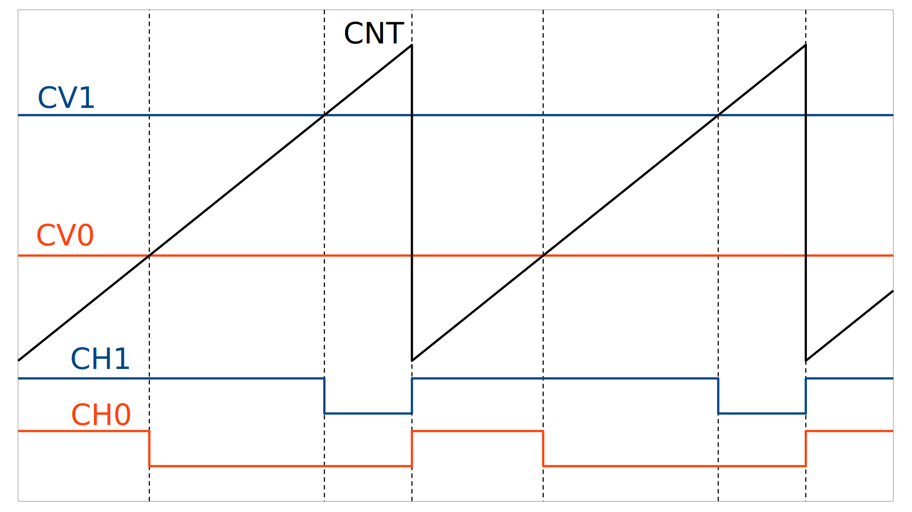
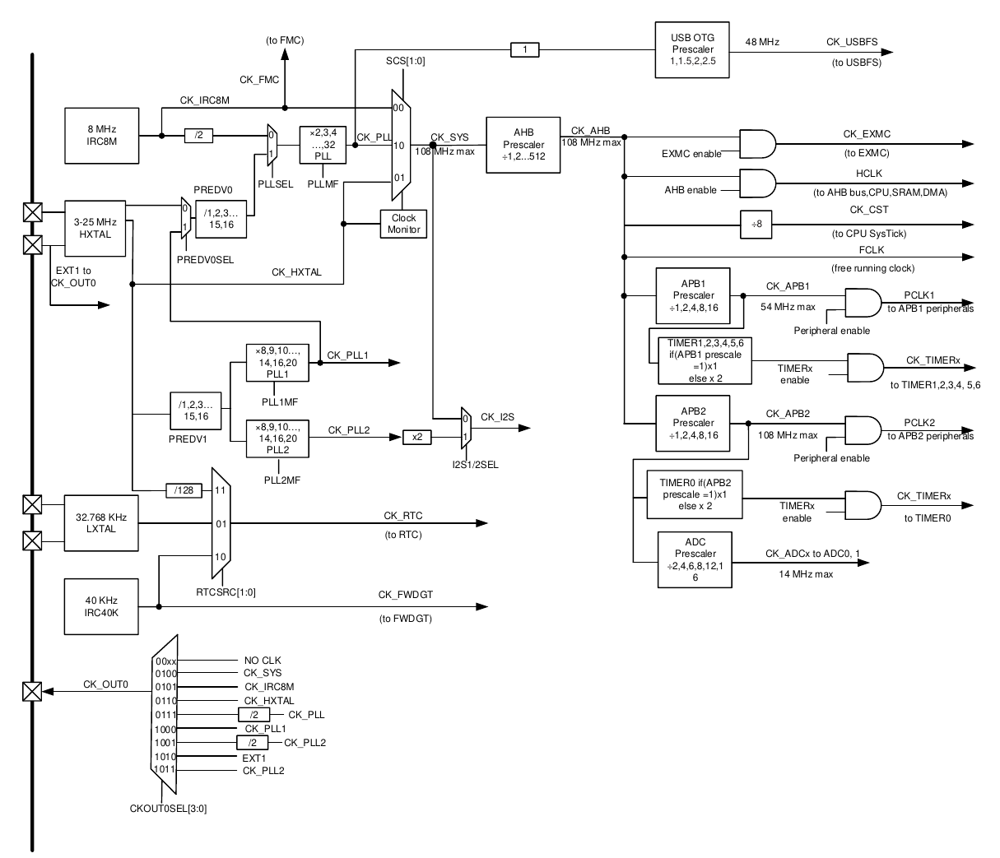

# Практическое применение RISC-V при программировании микроконтроллеров

[(Оглавление)](index.md)

# 9. Таймеры

При разработке электронных устройств достаточно быстро возникает необходимость узнать сколько времени прошло с момента какого-либо события. Самое банальное - ручная реализация какого-нибудь интерфейса, например, UART, где нужно выдерживать правильные интервалы между битами чтения или записи.

С точки зрения теории жизненно необходимым соответствующий аппаратный модуль не является, ведь всегда можно посчитать такты на каждую инструкцию и, зная тактовую частоту, перевести их в секунды. Однако с усложнением программы, введением прерываний, да и просто удобства, такой подход быстро становится бесполезным на практике. Поэтому разработчики вычислительных схем добавляют в них аппаратные таймеры/счетчики.

## 9.1 Системные таймеры mcycle, mtime

В RISC-V для счета времени используется два счетчика, **mcycle** для счета тактов, прошедших с момента старта (64-битный счетчик, расположенный в двух регистрах) и **mtime** - "реальное время", измеряемое в абстрактных единицах и тоже 64-битное. Использование первого никаких проблем не вызывает. В приведенном коде считывается только младшая половина счетчика. При тактовой частоте от 8 до 108 МГц это позволяет измерять интервалы времени примерно 39 от до 356 секунд - для большинства реальных задач более чем достаточно. Более длинные интервалы обычно измеряются уже другими способами.

```c
inline uint32_t read_mcycles(){
  uint32_t res;
  asm volatile("csrr %0, mcycle" : "=r"(res) );
  return res;
}
```

А вот **mtime** расположен не в CSR регистрах, а в MMIO начиная с адреса 0xD100'0000. Причем, что самое обидное, этот адрес ни в какой документации не прописан, ковыряйте код примеров. Зато у этого таймера несколько больше возможностей, чем у предыдущего. В качестве тактового сигнала можно задать либо частоту ядра, деленную на 4, либо частоту ядра без деления, за это отвечает бит CLKSRC регистра mtimectl. Также по достижении таймером значения, заданного в регистре mtimecmp может быть сгенерировано прерывание, а значение счетчика может быть сброшено в ноль (бит CMPCLREN регистра mtimectl). Вот только есть одна проблема: **ни тот, ни другой биты этого регистра просто не работают!**. Но хотя бы прерывание генерируется...

Если кто-то хочет подробнее с ними ознакомиться, можно почитать, например, тут:

https://riscv-mcu.github.io/Webpages/CORE_Page2/#3-1 - китайская грамота

https://www.nucleisys.com/upload/file/2020/02/1582893692-9103.pdf - что-то вроде перевода китайской грамоты

https://doc.nucleisys.com/nuclei_spec/isa/timer.html - прочие регистры

Как результат, единственное разумное применение mtime'у, которое я нашел, заключается в таймере для операционной системы. В mtimecmp настраивается период 1 кГц, а в обработчике значение mtime сбрасывается в ноль. Ручное управление счетным регистром, разумеется, моментально рушит точность счета, но для операционной системы это не критично.

Как бы то ни было, при помощи mcycle можно реализовывать *точные* задержки вроде вот таких:

```c
#define F_CPU 8000000 //тактовая частота
void delay_cycles(uint32_t cycles){
  int32_t cur_cycles, av_cycles;
  av_cycles = read_mcycles() + cycles;
  do{cur_cycles = read_mcycles();}while( (av_cycles - cur_cycles) > 0 );
}
void delay_us(uint32_t us){
  int32_t cur_cycles, av_cycles;
  av_cycles = read_mcycles() + (us * (F_CPU / 1000000));
  do{cur_cycles = read_mcycles();}while( (av_cycles - cur_cycles) > 0 );
}
```

Обратите внимание на способ задания интервала. Нельзя просто проверить на больше-меньше, потому что 32-битный счетчик переполняется довольно быстро. А вот *знаковая* разность переполняться не будет... ну, по крайней мере, пока разница не достигнет половины диапазона типа данных. Значит, не надо задавать задержку больше 20 секунд.

Аналогично можно выполнять произвольный код с заданным интервалом:

```c
#define PERIOD (F_CPU / 1000) //выполнение кода с частотой 1 кГц
uint32_t av_cycles = 0, cur_cycles;
...
cur_cycles = read_mcycles();
if( (av_cycles - cur_cycles) <= 0 ){
  av_cycles += PERIOD; //здесь важно менять только регистр сравнения и только относительно него же
  //а здесь добавляем какой-нибудь полезный код
}
```

## 9.2 Периферийные таймеры-счетчики

Раз уж в контроллере есть примитивный таймер, очевидным представляется и решение производителей как добавить туда еще больше таймеров, так и сделать их более развесистыми. Но тут разнообразие вариантов оказывается уж слишком зашкаливающим, поэтому набор дополнительных таймеров был оставлен на усмотрение производителя конкретной железки, а не ядра. Соответственно и располагаться таймеры/счетчики будут в пространстве MMIO, а не CSR.

Начнем с простого - изучения User Manual'а на наш контроллер. В нем сказано, что таймеров семь: один расширенный, четыре обычных и два урезанных. Для примера рассмотрим Timer3. Регистров у него много, но нас интересуют следующие:

- TIMER_CNT - собственно регистр счета. Записывать мы туда ничего не будем, но вот считать текущее значение можно. Хотя бы чтобы проверить идет ли вообще счет.
- TIMER_PSC - предделитель
- TIMER_CAR - модуль счета
- TIMER_CTL0 - управляющий регистр, в котором нас интересует бит CEN разрешения работы таймера.

Ну и как и с любой другой периферией, перед использованием на нее надо подать тактирование. В случае Timer3 это шина APB1, именно импульсы ее тактирования таймер и считает. Причем он может считать не каждый импульс, а каждый второй, каждый пятый, каждый 321-й - именно за это отвечает регистр предделителя **PSC**. Максимальное значение, до которого таймер считает, пока не переполнится, также можно настраивать, для этого служит регистр **CAR**. Еще стоит упомянуть, что таймер умеет считать не только "вверх", увеличивая CNT с каждым тактом, так и "вниз", уменьшая, и даже в обоих направлениях - пока не достигнет CAR увеличивает, потом начинает уменьшать, пока не достигнет нуля, после чего снова увеличивать. Также при достижении крайних точек счета, может генерироваться прерывание. Зная все это, уже можно воспроизвести как работу mcycle, так и mtime. Но, разумеется, возможности таймера этим не ограничиваются.

### 9.2.1 ШИМ



Но прежде, чем рассматривать очередную интересную возможность таймера, стоит сделать небольшое отступление о том, что такое широтно-импульсная модуляция (**ШИМ, pulse-width modulation, PWM**). По сути, это быстрое-быстрое переключение состояния ножки между лог.0 и лог.1 чтобы плавно управлять каким-либо устройством. Например, светодиодом. Допустим, высокий уровень подается на ножку на 20% времени - тогда и светиться диод будет на 20% от максимума. Только надо учитывать, что в случае светодиода видимая яркость обусловлена инерционностью зрения, на самом-то деле он все равно мерцает, просто этого не заметно. А вот лампочка накаливания при определенной частоте может и не успевать остыть. Кроме того, видимая яркость связана с коэффициентом заполнения (так называется та самая доля общего времени) нелинейно. Код для ручной демонстрации этого эффекта довольно прост:

```c
#define PERIOD (8000000) //1 сек на итерацию
uint32_t av_cycles = 0, cur_cycles;
uint32_t cnt = 0;
uint32_t pwm = 10;
while(1){
  cnt++;
  if(cnt >= 100)cnt = 0;
  if( cnt < pwm )GPO_ON(YLED); else GPO_OFF(YLED);
  sleep(100000);
  
  cur_cycles = read_mcycles();
  if( (av_cycles - cur_cycles) <= 0 ){
    av_cycles += PERIOD;
    pwm++;
    if(pwm >= 100)pwm = 0;
  }
}
```

Задержка здесь нужна чтобы успеть глазом заметить мерцание. Можно поэкспериментировать с ней - при каком значении мерцание совсем пропадет и станет заметно только плавное изменение яркости.

Во-первых, стоит отметить, что использование mcycle позволило сделать скорость изменения яркости линейной и независимой от скорости выполнения самого цикла, даже если она непостоянна.

А во-вторых, ШИМ здесь программный, то есть будет с одной стороны отъедать ресурсы процессора, а с другой - терять точность, поскольку время задержки может изменяться например от скорости выполнения цикла, возникающих прерываний и всего остального.

Поэтому давайте посмотрим, как реализовать тот же ШИМ, но уже средствами таймера. Но тут возникает первое ограничение: в отличие от программного "ногодрыга", аппаратный привязан к конкретным ножкам, у каждого таймера своим. Если заглянуть в документацию, станет видно, что ножкам PB5 - PB7, на которых висят светодиоды, соответствуют Timer2_ch1 (remap), Timer3_ch0 и Timer3_ch1. С ремапом сейчас разбираться неохота, поэтому возьмем Timer3 и его нулевой канал. Помимо уже знакомых нам регистров добавляются еще несколько.

- TIMER_CH0CV - регистр сравнения для 0-го канала. Это то самое значение, на котором значение ножки будет меняться. В предыдущем коде его роль играла переменная pwm.
- TIMER_CHCTL0 - регистр настройки нулевого и первого каналов. В нем нас интересуют биты CH0COMCTL (их надо выставить в 0b110) и CH0MS (0b00), а также бит CH0EN в регистре TIMER_CHCTL2. Почему именно они и почему именно такие значения, лучше почитать в Useer Manual'е.

Также режим работы ножки надо изменить с GPIO push-pull на alternative-function push-pull, иначе за управление будет отвечать код, а нам ведь нужно поручить это таймеру.

**Внезапное отступление:**

В регистре TIMER_CHCTL0 нам надо за раз изменить три бита. Не делать же это по одному. К сожалению, разработчики GD32VF103 не слишком-то упростили эту задачу. Придется вспомнить битовую магию! У нас есть регистр, в нем нужно стереть три бита, заданных битовой маской TIMER_CHCTL0_CH0COMCTL, после чего на то же место записать другое число. Стереть биты несложно, интереснее придумать, как сдвинуть число на нужное количество битов. Если бы у нас была маска, хранящая только одну единицу, проблем бы не было, умножить на нее и все - я так уже делал при настройке портов. Но у нас не одна единица, а три, надо придумать, как убрать лишние. Логическая операция, превращающая что угодно в ноль по маске, всего одна - AND. Причем мы заранее знаем, что кроме интересующих нас битов все остальные равны нулю, а наши идут подряд. Для простоты проиллюстрирую на примере 8-битных чисел:

```
bits	0b01110000 AND
mask	0bx001xxxx
res 	0b00010000
```

Знаками ```x``` обозначено, что данные биты могут быть любыми: после побитового умножения на ноль они в любом случае обнулятся. Возникает искушение просто сдвинуть исходную маску на 2 бита вправо. Но это будет не универсальным: вдруг в другом регистре поле будет 5 битов, или 2, или еще сколько-то. А что если сдвинуть на 1 бит влево? Получим 0b11100000, уже почти то, что нужно, только биты инвертированы. Но уж это исправить несложно:

```
bits	0b01110000
 <<1	0b11100000
 NOT	0b00011111
------------------
mask	0bx001xxxx
```

Как видим, интересующие нас биты приняли нужные значения, а остальные - какое попало. Отлично! Осталось оформить эту магию в виде макроса:

```c
#define PM_BITMASK( reg, mask, val ) do{ (reg) = ((reg) &~ (mask)) | (((mask) &~((mask)<<1))*(val)); }while(0)
```

**Переходим наконец к коду**

```c
#define TIM	B,6,1,GPIO_APP50
...
GPIO_config(TIM);

TIMER_PSC(TIMER3) = 0;
TIMER_CAR(TIMER3) = 100;

TIMER_CH0CV(TIMER3) = 80;
PM_BITMASK( TIMER_CHCTL0(TIMER3), TIMER_CHCTL0_CH0COMCTL, 0b110 ); //прямой ШИМ
PM_BITMASK( TIMER_CHCTL0(TIMER3), TIMER_CHCTL0_CH0MS, 0b00 );
TIMER_CHCTL2(TIMER3) |= TIMER_CHCTL2_CH0EN;

TIMER_CTL0(TIMER3) = TIMER_CTL0_CEN;
...
while(1){
  cur_cycles = read_mcycles();
  if( (av_cycles - cur_cycles) <= 0 ){
    av_cycles += PERIOD;
    TIMER_CH0CV(TIMER3)++;
    if(TIMER_CH0CV(TIMER3) >= 100)TIMER_CH0CV(TIMER3) = 0;
  }
}
```

Вот и все, теперь программно мы меняем только коэффициент заполнения, а импульсы генерирует сам таймер.

### 9.2.2 Прочие возможности таймеров/счетчиков

Обилие настроек каналов таймера нам намекает, что возможности одним ШИМом не ограничиваются. Собственно, правильное название этой периферии звучит как "таймер/счетчик", а не просто "таймер": считать он умеет не только импульсы тактирования ядра (пусть даже пропущенные через предделитель), но и импульсы, поступающие на одну из ножек. В таком случае он работает уже не как таймер, а именно как счетчик. Также в нашем контроллере некоторые таймеры/счетчики умеют аппаратно обрабатывать события энкодера - это такая крутилочка, которая выдает цифровой сигнал при каждом повороте на определенный угол. Колесико мышки, например, тоже энкодер. Еще одна способность таймера - захват. По импульсу на ножке значение счетного регистра CNT копируется в регистр сравнения CHxCV - таким способом можно считать длительность внешнего импульса.

Впрочем, обычно используют все же термин "таймер", поскольку в этой роли он используется чаще всего.

А вообще, у таймеров-счетчиков в GD32VF103 возможностей много. Это и управление DMA, и управление АЦП и даже другими таймерами. В общем, изучайте документацию, там много интересного.

## 9.3 Часы реального времени (real-time clock, RTC)

До сих пор все интервалы времени задавались в терминах импульсов ядра. А что на счет собственно отсчета времени - часы, секунды, месяцы? А это существенно более редкая задача, решить которую в принципе можно и на обычном таймере. Тем не менее, существуют специальные микросхемы вроде **DS1307** (или более современные), предназначенные ровно для этого - считать абсолютное время, вести календарь и не потреблять при этом слишком много энергии. Для точности такие микросхемы тактируются не от чего попало, а от специального кварцевого резонатора, называемого часовым (потому что изначально он и задумывался как источник тактирования для часов), плюс специальная батарейка, чтобы счет времени не прекращался, даже если устройство выдернут из розетки. Плюс несколько ячеек памяти общего назначения, чтобы и контроллер мог там хранить какие-то настройки, переживающие отключение питания. Вот только... неужели ради простого счета времени еще одну микросхему ставить?

К счастью, нет. Модуль часов реального времени в большинстве контроллеров есть встроенный. Тактируется он все так же от часового кварца, для которого предусмотрены специальные ножки (которые мы скорее всего будем использовать по другому назначению - периферией управлять, а часы перебьются) и отдельная ножка для подключения резервной батарейки. Даже сохраняемые ячейки памяти предусмотрены! Но разумеется, и здесь есть свои тонкости.

В первую очередь надо помнить, что частота тактирования RTC намного меньше, чем ядра. Соответственно, и обновлять регистры с той же скоростью он не может, поэтому предусмотрены специальные регистры синхронизации. Но мало того, что частота часов низкая, она еще и не привязана к частоте ядра и может выбираться из следующих вариантов: часовой кварц 32768 Гц; встроенный RC-генератор 40 кГц; внешний высокочастотный кварц, деленный на 128. А еще, как следует из логики их применения, на момент включения ядра RTC скорее всего уже настроен и считает время.

Выбор источника тактирования осуществляется битами RCU_BDCTL_RTCSRC. Но по умолчанию все неиспользуемые блоки, в том числе тактовые генераторы, в контроллере остановлены. Поэтому при инициализации часов надо сначала попытаться запустить LXTAL (низкочастотный кварц), дождаться, пока он выйдет в рабочий режим, и только потом переключаться на него. Но кварцевый резонатор это внешнее устройство, он может сломаться, его ножки могут оказаться закорочены, с ним могут произойти другие неприятности. Поэтому если кварц не заводится, можно попробовать использовать в качестве тактового генератора встроенный RC-генератор на 40 кГц. Его точность, конечно, значительно хуже, чем у кварца, но это лучше, чем ничего. Кстати, наш контроллер умеет отслеживать исправность кварца не только при старте, но и во время работы, и если тактирование внезапно прекращается - генерировать прерывание.

```c
void RTC_init(){
  //разрешить тактирование модулей управления питанием и управлением резервной областью
  RCU_APB1EN |= RCU_APB1EN_PMUEN | RCU_APB1EN_BKPIEN;
  //разрешить доступ к области резервных данных
  PMU_CTL |= PMU_CTL_BKPWEN;
  
  //if( !(RCU_BDCTL & RCU_BDCTL_RTCEN) ){ //если часы уже запущены, инициализировать их повторно не требуется
  if(1){ //но у нас не практическая задача, а учебная, поэтому инициализировать будем при каждом включении
    //выполнить сброс области резервных данных
    RCU_BDCTL |= RCU_BDCTL_BKPRST;
    RCU_BDCTL &=~RCU_BDCTL_BKPRST;
    
    RCU_BDCTL |= RCU_BDCTL_RTCEN;
    
    RCU_BDCTL |= RCU_BDCTL_LXTALEN;
    uint32_t i;
    for(i=0;i<0x0FFF;i++){
      if(RCU_BDCTL & RCU_BDCTL_LXTALSTB){i=0x1FFF; break;}
    }
    
    if(i == 0x1FFF){ //LXTAL success
      i = 32768;
      RCU_BDCTL = (RCU_BDCTL &~ RCU_BDCTL_RTCSRC) | RCU_RTCSRC_LXTAL;
    }else{ //LXTAL fail
      RCU_RSTSCK |= RCU_RSTSCK_IRC40KEN;
      while( !(RCU_RSTSCK & RCU_RSTSCK_IRC40KSTB) ){}
      i = 40000;
      RCU_BDCTL = (RCU_BDCTL &~ RCU_BDCTL_RTCSRC) | RCU_RTCSRC_IRC40K;
    }
    
    RTC_CTL |= RTC_CTL_CMF;
    RTC_PSCL = i;
    RTC_CNTL = 0; //ВАЖНО! В видеоверсии я это забыл
    RTC_CNTH = (TIME_INIT >> 16) & 0xFFFF;
    RTC_CNTL = (TIME_INIT) & 0xFFFF;
    RTC_CTL &=~RTC_CTL_CMF;
    
    RTC_CTL &=~ RTC_CTL_RSYNF; //sync
    while( !(RTC_CTL & RTC_CTL_RSYNF) ){}
  }else{
    if( (RCU_BDCTL & RCU_BDCTL_RTCSRC) == RCU_RTCSRC_IRC40K ){ //IRC40KEN к сожалению сбрасывается по ресету
      RCU_RSTSCK |= RCU_RSTSCK_IRC40KEN;
      while( !(RCU_RSTSCK & RCU_RSTSCK_IRC40KSTB) ){}
    }
  }
}

//ВАЖНО! В видеоверсии я это забыл
uint32_t rtc_read(){
  uint16_t res_H1= RTC_CNTH;
  uint16_t res_L = RTC_CNTL;
  uint16_t res_H2= RTC_CNTH;
  if(res_H1 != res_H2)res_L = RTC_CNTL;
  
  return ((uint32_t)res_H2)<<16 | res_L;
}
```

Разные реализации часов реального времени обладают разными возможностями от простейшей генерации прерывания раз в секунду (тогда как собственно счет - забота программиста) до полноценного календаря с несколькими будильниками. У нас нечто среднее: часы работают автономно, но считают только секунды. Чтобы перевести их в время-дату воспользуемся функцией декодирования unix-time'а (не помню откуда я ее скопировал, если честно):

```c
typedef struct{
  uint16_t year;
  uint8_t month;
  uint8_t day;
  uint8_t day_week;
  uint8_t hour;
  uint8_t min;
  uint8_t sec;
}date_time_t;

void utc2date(date_time_t *res, uint32_t time){
  uint32_t a, b, c, d, e, m;
  uint32_t jd = 0;
  uint32_t jdn = 0;
  time += 3*60*60;
  jd = ((time+43200)/(86400>>1)) + (2440587<<1) + 1;
  jdn = jd>>1;
  res->sec = time % 60;
  time /= 60;
  res->min = time % 60;
  time /= 60;
  res->hour = time % 24;
  time /= 24;
  
  res->day_week = jdn % 7;
 
  a = jdn + 32044;
  b = (4*a+3)/146097;
  c = a - (146097*b)/4;
  d = (4*c+3)/1461;
  e = c - (1461*d)/4;
  m = (5*e+2)/153;
  res->day = e - (153*m+2)/5 + 1;
  res->month = m + 3 - 12*(m/10);
  res->year = 100*b + d - 4800 + (m/10);
}
```

## 9.4 WatchDog Timer

Пожалуй, последняя разновидность таймера это сторожевая собака, watchdog - специальный таймер, предназначенный следить не завис ли контроллер, и сбрасывающий его если что-то пошло не так. В штатном режиме выполняемый код периодически посылает таймеру команду "в Багдаде все спокойно". Если этой команды не поступает слишком долгое время, таймер перезагружает контроллер. Подробно описывать его функциональность я смысла не вижу, достаточно упомянуть, что такое тоже бывает.

## 9.5 Система тактирования



Вот так выглядит система тактирования нашего контроллера. На первый взгляд довольно страшно, но попробуем последовательно разобраться что и для чего нам нужно. Первоначальным источником тактового сигнала может быть либо IRC8M, RC-генератор 8 МГц, включенный по умолчанию, либо внешний кварц, висящий на выводах HXTAL. В зависимости от битов **SCS** и **PREDIV0SEL** в качестве тактирования ядра **CK_SYS** будет использоваться один из этих сигналов, либо сигнал с делителя-умножителя частоты. Коэффициент умножения задается битами **PLLMF**, коэффициент деления - **PREDIV0**. Источником входного сигнала для этого модуля могут быть все те же IRC8M или HXTAL. Ну а после настройки тактирования ядра **CK_SYS** ее можно еще поделить чтобы настроить частоту шины AHB, а из нее APB1 и APB2 - обратите внимание на максимальные значения частот этих шин.

Важный момент: кварц перед использованием надо включить битом HXTALEN и дождаться пока он действительно запустится. Это мы уже видели при настройке часового кварца. Как и возможность генерировать прерывание в случае его поломки. Тактирование ядра контроллера при этом автоматически переключается на встроенный высокочастотный RC-генератор - нужно же как-то обработать прерывание, да и вообще продолжать работу.

Ну и если эта схема тактирования показалась кому-то излишне сложной, спешу обрадовать: в других контроллерах она бывает еще сложнее!

## 9.6 Бонус: генерация звука

Для демонстрации возможностей таймера я решил воспроизвести на нем отрывок мелодии. Вообще-то, воспроизведение звука при помощи ШИМ - стандартный способ, он применяется даже там, где контроллерами и не пахнет - в усилителях класса D. Идея в том, что сигнал с микрофона подвергается "обратному ШИМ-преобразованию", то есть превращается в последовательность единиц и нулей различной длины, потом напряжение логической единицы усиливается (например, было 3.3 вольта, а станет 15 вольт), благо уж цифровой сигнал можно усиливать совершенно не заботясь о линейности, искажениях и прочих проблемах аналоговой техники. А потом уже усиленный сигнал прогоняют через фильтр низких частот чтобы преобразовать обратно в аналоговую форму.

Нам же при наличии микроконтроллера необходимости в микрофоне нет, можно цифровой сигнал просто синтезировать. Скажем, чтобы вывести простейший синусоидальный сигнал, надо последовательно выводить в регистр ШИМа значения синусоиды в каждый момент времени. Еще более интересный эффект будет если выводить не просто синусоиду, а содержимое wav-файла, ведь в нем записаны именно последовательности значений сигнала.

Чтобы это тестировать, я соединил вывод PA8 контроллера с аналоговым входом каракатицы (через фильтр низких частот, разумеется) и научил ее работать не только как программатор, переходник на UART и управлялку клавиатурой, но и как USB-микрофон. Вывод PA8, согласно документации, может управляться 0-м каналом Timer0. Это "продвинутый" таймер, поэтому и настройка у него чуть сложнее, чем у обычного. Правда, всего на один бит, но я потратил на его поиски довольно много времени, поэтому упомянуть его стоит:

```c
TIMER_CCHP(TIMER0) = TIMER_CCHP_POEN;
```

Само собой, с выводом звукового фрагмента я тоже экспериментировал. Если кто-то захочет повторить этот "подвиг" (пф-ф-ф, было бы что повторять, там кода на десяток строчек, не считая уже написанного к настоящему времени), подскажу несколько команд в makefile, которыми я воспользовался. Предварительно при помощи ffmpeg'а я подогнал битрейт и разрядность, а также вырезал нужный кусок. Все-таки без сжатия звук занимает довольно много места. Ну и еще одна подсказка: на частоте ядра 108 МГц звук шакалится чуть менее ужасно, чем на 8 МГц.

Мой вариант прошивки, которая генерирует звук, также доступен в [репозитории](https://github.com/KarakatitsaRISCV/riscv-asm/tree/main/8.timer/example) (разумеется, без исходников)

```
CFLAGS += -DAUDIOSRC='"_binary_src_audiodata_wav"'
...
$(builddir)/audiodata.o: $(srcdir)/audiodata.wav
	mkdir -p $(builddir)
	$(CROSS_COMPILE)ld -melf32lriscv -r -b binary -o $@ $<
	$(CROSS_COMPILE)objcopy --rename-section .data=.rodata,alloc,load,readonly,data,contents $@ $@
```

Благодаря этому создается объектный файл audiodata.o с бинарными данными, начало и конец которых можно получить при помощи несложной конструкции:

```c
extern const uint8_t adata_start[]   asm(AUDIOSRC "_start");
extern const uint8_t adata_end[]     asm(AUDIOSRC "_end");
```

Это заклинание будет полезным и при добавлении любых других бинарных данных в проект. Собственно, оно было выдернуто из другого моего проекта - "флешки" на контроллере, где таким способом в прошивку вклеивался собственно образ флешки.

## 9.6.1 Анализ звукового сигнала на локальной машине

Если контроллер лежит перед вами и подключен к звуковому входу каракатицы или обычного микрофона, работать со звуком можно в реальном времени. Гонять звуковой сигнал по сети не стоит. Опишу то, что я тестировал у себя на локальной машине

Для начала надо определить адес "микрофона" чтобы с ним работать:

```pacmd list-sources | grep -e 'index:' -e device.string -e 'name:'``` -  там будет что-то вроде "alsa_input.usb-COKPOWEHEU_USB_RISCV_programmer_1-05.mono-fallback"

```ffmpeg -f pulse -i "alsa_input.usb-COKPOWEHEU_USB_RISCV_programmer_1-05.mono-fallback" -ac 2 -y audio.mp3``` - собственно запись в файл

```ffplay -f pulse "alsa_input.usb-COKPOWEHEU_USB_RISCV_programmer_1-05.mono-fallback"``` - воспроизведение прямо с микрофона

Ну а посмотреть осциллограмму можно например утилитой ```xoscope```. Синхронизация выбирается кнопкой ```+```, скорость развертки ```0```, ```9```. Остальное смотрите в документации, она небольшая.

С образцами [исходного](https://github.com/KarakatitsaRISCV/riscv-asm/blob/main/8.timer/src/src.wav) wav-файла и его [записью](https://github.com/KarakatitsaRISCV/riscv-asm/blob/main/8.timer/src/res.mp3) с "микрофона" каракатицы также можно ознакомиться.

## Для стенда

В случае же удаленной работы, без возможности пробросить аудио по сети, лучше записать его в файл, скопировать к себе и анализировать локально. Микрофона на стенде не предусмотрено, поэтому я решил добавить соответствующую функцию самой каракатице. Она читает аналоговый сигнал со своего входа, соединенного с PA8 нашего подопытного и, прикидываясь USB-микрофоном, передает его в компьютер.

На стенде не установлен pulseaudio, поэтому доступ через alsa. Надо убедиться, что пользователь входит в соответствующую группу и имеет доступ к устройству, после чего

```
ffmpeg -channels 1 -f alsa -i hw:0 -y audio.mp3
```

xoscope там нет, скачивайте файл к себе и анализируйте локально.

## Заключение

Мы познакомились с различными системами счета времени, или импульсов тактирования ядра, или вообще внешних сигналов. Научились плавно регулировать напряжение на нагрузке (светодиоде или динамике), одним глазком глянули на систему тактирования самого контроллера и узнали как именно ему можно поднять производительность.

Исходный код примера доступен на [github](https://github.com/KarakatitsaRISCV/riscv-asm/tree/main/8.timer)

### Д/З

1. Определите сколько тактов занимает чтение по выровненному и невыровненному адресу в случае ОЗУ, ПЗУ и MMIO (а что, физически это ведь разная память!)
2. Определить сколько тактов занимает вход в прерывание и выход из него (по сути - скорость реакции на внешнее событие).
3. Зависит ли это время от частоты ядра?
4. В лекции на 15:05 я сказал "задержка ровно в 1 секунду, точнее в 8000000 тактов". Почему это не одно и то же?
5. Почему при записи в mtime я всегда начинаю с MTIME_LO и только потом MTIME_HI, а mtime_cmp - нет?
6. Реализуйте плавное мигание светодиодом на PB5 (это тот, который с ремапом) при помощи ШИМ. Яркость должна меняться по синусоидальному закону, частота синусоиды задаваться с UART в человеко-читаемом виде (период в миллисекундах или частота в миллигерцах)
7. Поэкспериментируйте с ШИМ, выводом звука и анализом осциллограмм.