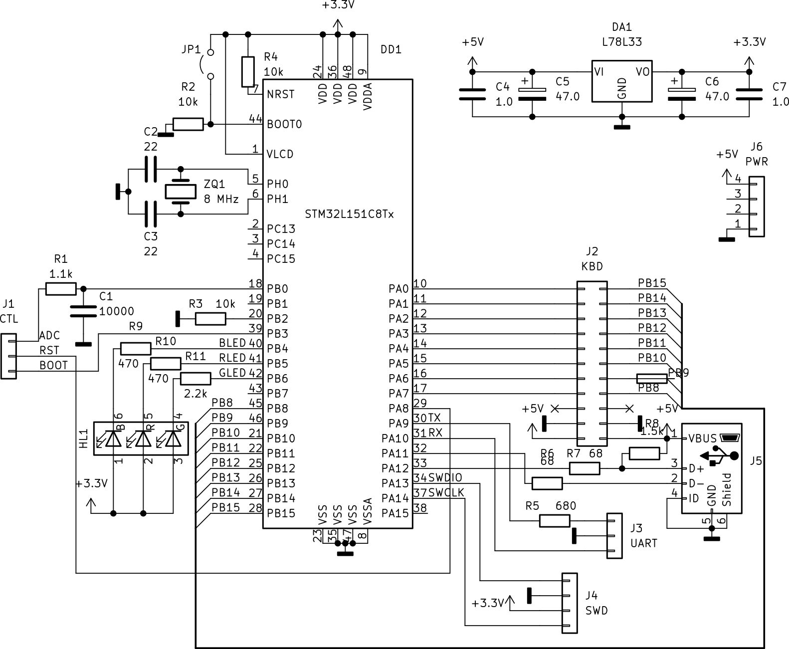

# Каракатица: устройство и принцип работыы
[назад](1.intro.md)

# 1. Введение и руководство пользователя

## 1.1. Способы прошивки микроконтроллера

Наиболее распространенным способом программирования контроллеров является использование интерфейса JTAG. Несколько реже - SWD, еще реже всякие узкоспецифичные вещи вроде высоковольтного программирования или ISP. Но это если говорить о прошивке контроллера "перед продажей", то есть пока плата находится у разработчика. А что делать, если надо обновить прошивку на устройстве, которое уже два года висит на столбе в трех тысячах километров где-то у заказчика? Не заставлять же его покупать программатор, изучать среду разработки, вскрывать корпус, ... На такой случай в большинстве контроллеров предусмотрена возможность самопрограммирования: кусок кода помечается как загрузочный (bootloader), и может быть запущен путем какого-нибудь хитрого колдунства. Например, должна быть зажата определенная кнопка при старте, или пришла специальная команда, или воткнута определенная флешка. Тогда загрузчик запускается, считывает откуда-нибудь новую прошивку и записывает ее в основную память контроллера. Поскольку загрузочный код это код, то разнообразие способов получения прошивки ограничено только фантазией программиста (и в меньшей степени техническими ограничениями контроллера - какие интерфейсы доступны, хватает ли памяти). Плюс у каждого производителя контроллеров свое представление о тонкостях перехода в режим самопрограммирования. Поэтому рассматривать вообще все возможные варианты загрузчиков мы не будем.

Но вот один частный случай рассмотреть стоит - загрузчик, записанный производителем. В нашем случае, GigaDevice. Активируется он замыканием BOOT0 на **лог.1**, а BOOT1 на **лог.0** с последующим рестартом контроллера. В результате этого контроллер начинает работать в роли программатора для самого себя. В случае GD32VF103 он может подключаться по USB (тогда для прошивки можно использовать например ```dfu-util```) или по UART (тогда хорошо работает например ```stm32flash```). Из этих двух вариантов более удобным оказывается, как ни странно, UART. Он и проще, и надежнее, и отлаживать через него потом можно. И пробросить в виртуальную машину, если что.

Вот только чтобы прошить контроллер через UART, надо провести целую кучу операций: выставить BOOT0 в лог.1; дернуть ресет; запустить утилиту прошивальщика; выставить BOOT0 в лог.0; снова дернуть ресет. Поначалу я это делал руками, и для первого личного знакомства с контроллерами такой способ более чем подходит. Но со временем захотелось его слегка автоматизировать. В переходниках USB-UART или COM-UART почти всегда можно найти "лишние" проводки - RTS, DSR, CTS и прочие. На самом деле они, конечно, не лишние, а служебные для связи с модемом. Но при программировании они не используются. Можно было попытаться воспользоваться ими. Но если уж делать программатор, стоит несколько заморочиться и сделать более удобную штуку.

## 1.2. Удаленная разработка

Одной из целей этого цикла статей была возможность дать всем желающим потыкать палочкой в реальный контроллер без необходимости его покупать. Проблема только в том, что контроллер всего один, посылать его каждому желающему по почте было бы неудобно, лучше сделать "палочку" дистанционно управляемой. Иначе говоря, программатор должен поддерживать не только собственно программирование и отладку, но и некоторые функции периферии, которую обычно подключают к контроллеру. И уже вот это реализовывать на какой-нибудь ft232 совсем неудобно. Ну хотя бы потому что и программирование, и отладочный вывод идут через один и тот же UART0, то есть постоянно надо переключаться между stm32flash и screen. Не говоря уж о работе с клавиатурой или аудиоустройством.

Поэтому сердцем программатора выбрана не какая-то специализированная микросхема, а самый что ни наесть обычный контроллер, который можно запрограммировать так, как нам нужно. В качестве конроллера я выбрал STM32F103 или STM32L151, потому что с ними я более знаком и уже успел более-менее разобраться с тамошним USB. Почему целых два контроллера? Просто они крайне похожи друг на друга и по периферии, и даже совместимы по выводам. Собственно, первые опыты я вообще проводил на отладочных платах, на которых с ними же знакомился. Именно поэтому Каракатица, мелькающая в роликах, выглядит почти неотличимо от подопытного контроллера на RISC-V: это и в самом деле одинаковые платки, только запаян в одном случае STM32F103, а в другом - GD32VF103. Сейчас же пришло время оформить наконец программатор как программатор, а не как набор костылей. Исторически так сложилось, что у программатора сразу появилось название **Каракатица**. Возможно, из-за того, что он выглядел как какое-то непонятное беспозвоночное с кучей ~~щупалец~~ проводков, опутывающих жертву.

## 1.3. Makefile и принцип программирования - отладки

Для того чтобы не переключаться между интерфейсами программирования и отладки, достаточно просто сделать два отдельных интерфейса ```/dev/tty_PROG_0``` и ```/dev/tty_DBG_0```, физически работающих с одной и той же парой Rx/Tx.

Управление линиями RST и BOOT (и еще USBR, но о ней позже) я решил повесить на тот же ```/dev/tty_PROG_0```, но только при скорости 50 бод (для справки, при программировании скорость составляет 57600 бод, да еще с проверкой четности), а само управление - посылкой обычных текстовых символов: 'r', 'R' - ресет, 'b', 'B' - BOOT, 'u', 'U' - USBR. Прописная буква означает выставить активный уровень, строчная - снять.

Небольшое отступление на счет USBR: изначально предполагалась возможность отладки встроенного USB в этом контроллере. Но проблема в том, что если перевести контроллер в режим программирования, а USB не выдернуть, он будет пытаться прошиться именно через него. Поэтому **если кто-то захочет воспользоваться функционалом USBR**, надо соединять USB линии данных D+, D- подопытного RISC-V с компьютером не напрямую, а через реле. Вот за управление реле линия USBR и отвечает. В финальной версии Каракатицы этого функционала нет, поскольку стенд расположен не на отдельной выделенной машине, а в виртуалке. А у нее не так-то просто настроить проброс конкретного физического USB-порта. Вот пробросить конкретное устройство проблем никаких. Но из кода я работу с USBR не выпиливал.

Рассмотрим кусок ```makefile```'а, отвечающий за программирование:

```
prog:	$(frmname).bin
	stty -F /dev/tty_STFLASH_0 300
	stty -F /dev/tty_STFLASH_0 50
	
	echo 'RBU' > /dev/tty_STFLASH_0
	sleep 1
	
	echo 'rBU' > /dev/tty_STFLASH_0
	sleep 1
	
	stm32flash /dev/tty_STFLASH_0 -w $(frmname).bin
	
	stty -F /dev/tty_STFLASH_0 50
	echo 'RbU' > /dev/tty_STFLASH_0
	
	sleep 1
	echo 'rbuz' > /dev/tty_STFLASH_0
```

Сначала скорость выставляется в 300 и тут же в 50, чтобы Каракатица точно перешла в режим ногодрыга. Отказаться от выставления в 300 нельзя, поскольку неизвестно не была ли выставлена скорость 50 ранее. Если была, повторная установка не приведет к передаче команд, и Каракатица не сможет узнать, что программист хотел поменять ей режим.

Дальше посылается три байта: 'R', 'B', 'U' - сигнал Ресет, высокий уровень на ```BOOT0``` и отключение USB. После секундной задержки (чтобы контроллер успел обработать сигналы) посылается еще три байта: 'r', 'B', 'U' - отпустить Ресет, оставить BOOT0 в лог.1, оставить USB разомкнутым. Теперь контроллер находится в режиме загрузчика.

Вызывется stm32flash для прошивки.

После окончания скорость обмена снова выставляется в 50 бод, и посылается две последовательности: "RbU" и "rbuz" - послать сигнал сброса и тут же вернуть контроллер в режим выполнения обычной прошивки. Символ 'z' обозначает выход из режима программирования. Вообще-то, Каракатица и сама из него выйдет по таймауту, но зачем ждать 10 секунд?

Отдельно стоит сказать, как переключается режим программатора - отладчика. При начале общения с /dev/tty_PROG_0 в зависимости от скорости включается либо режим программатора (TTYM_PROGR в коде), либо ногодрыга (TTYM_CTRL) и запускается таймер обратного отсчета на 10 секунд. Но каждый принятый байт этот таймер сбрасывает, благодаря чему прошивка может длиться сколько угодно по времени. По истечении таймаута (или приеме байта 'z' в режиме ногодрыга) режим сбрасывается на рабочий (TTYM_NORMAL).

Каждый из этих режимов отображается на светодиодном индикаторе.

**Важно** в некоторых примерах я мог забыть поменять 'RBU' на 'RbU' в предпоследней команде, возможно из-за этого контроллер не всегда корректно стартовал.

## 1.4. Отладка: UART

Как было сказано раньше, интерфейсы программирования **/dev/tty_PROG_0** и отладки **/dev/tty_DBG_0** друг с другом практически не конфликтуют. Дополнительно к этому я предусмотрел **/dev/tty_LOG_0**, в который дублируется весь лог обмена с /dev/tty_DBG_0 как на чтение, так и на запись. Возможно, ему тоже найдется применение.

## 1.5. Отладка: клавиатура

Устройство матричной клавиатуры я описывал в [соответствующей статье](8.matrix.md). Каждая кнопка представляет из себя электронный ключ, управляемый отдельным проводком. Размер матрицы 4х4 дает 16 ключей и соответственно 16 линий. Они подключаются к соответствующему разъему Каракатицы. На него удобнее всего оказалось вывести PA0 - PA7 и PB8 - PB15 напрямую, без всякой хитрой логики.

Ну а для управления этими 16 линиями я решил воспользоваться устройством типа HID (human interface device), которое примечательно тем, что не требует специальных драйверов и не слишком сложно в работе. Драйвер для визуализации его в виде красивых псевдографических кнопочек можно найти например [здесь](https://github.com/KarakatitsaRISCV/riscv-asm/tree/main/Kbd_driver). А если он кого-то не устраивает, всегда можно переписать под свой вкус.

## 1.6. Отладка: микрофон

Ставить настоящий динамик и микрофон на такую платку я, конечно, не стал. Да это и не нужно, ведь USB-устройство может работать как микрофон. Пришлось, конечно, добавить немного обвязки (банальная RC-цепочка) и здорово повозиться с реализацией собственно микрофона: не такое уж это простое устройство, надо сказать! Но как бы то ни было, сейчас в состав Каракатицы входит и USB-микрофон тоже - он оцифровывает сигнал с соответствующего аналогового входа и отправляет в компьютер на частоте 44 кГц.

## 1.7. Настройка системы

Теоретически, ничего жестко завязанного на операционную систему здесь нет. Но под виндой я эту штуку не тестировал, и какие-то подводные камни найтись могут. Например, там, похоже, нет простого способа дать COM-портам человеко-читаемый псевдоним, да и управление скоростью (которое нужно для переключения в режим программирования) там также делается по-другому. В общем, я не умею программировать под виндой, поэтому и описывать не буду.

Самое главное в настройке системы - разрешить юзеру доступ к COM-портам. Делается это просто добавлением пользователя в группу dialout. Далее стоит назначить различным COM-портам псевдонимы. На самом деле, это не обязательно, можно обращаться к портам через ```/dev/serial/by-id/...```, но через ```/dev/tty_X``` все же удобнее. Для этого заведем в ```/etc/udev/rules.d/``` правило с каким-нибудь большим номером, например ```98-usbserial.rules```:

```
SUBSYSTEM=="tty", ATTRS{manufacturer}=="COKPOWEHEU" ENV{CONNECTED_vusb}="yes"
ENV{CONNECTED_vusb}=="yes", SUBSYSTEM=="tty", ATTRS{interface}=="?*", PROGRAM="/bin/bash -c \"ls /dev | grep tty_$attr{interface}_ | wc -l \"", SYMLINK+="tty_$attr{interface}_%c"
```

Здесь ищется устройство, у которого поле 'manufacturer' равно "COKPOWEHEU", и для него заводится переменная окружения ```ENV{CONNECTED_vusb}="yes"```. В следующей строке анализируется каждое под-устройство для устройства, у которого эта переменная существует. Под-устройство должно иметь тип "tty" (переходник на COM-порт). Для такого под-устройства из дескриптора находится строковое описание интерфейса, и путем несложной шелльной магии подставляется в имя символьной ссылки.

**Важно** это правило я делал давным-давно и для себя. По-хорошему, его надо бы переписать. Скажем, название переменной CONNECTED_vusb не соответствует реальности.

В случае, если нужна работа с клавиатурой, стоит также разрешить юзеру доступ к устройству. Делается это опять через правила udev:

```
SUBSYSTEM=="usb", ATTRS{idVendor}=="16c0", ATTRS{idProduct}=="05df", GROUP="user", MODE="0660"
```

**Важно** idVendor, idProduct и manufacturer должны строго совпадать с теми, которые передает устройство. Посмотреть их можно командой ```lsusb``` (возможно, с ключом ```-v``` и от рута - зависит от системы). Если же возникло желание их поменять, добро пожаловать в файл usb_class.c, там описаны соответствующие константы.

# 2. Внутреннее устройство

## 2.1. Схема и плата

Разрабатывалось все это в KiCad, в [репозитории](https://github.com/KarakatitsaRISCV/riscv-asm/tree/main/Karakatitsa_stm32l151) лежат все исходники, в том числе прошивка для L151 и F103.

**Важно:** далее в тексте я постараюсь описать как можно упростить схему и прошивку, если кто-то захочет Каракатицу повторить, но не нуждается в определенном функционале вроде управления клавиатурой или микрофона.



Электрическая схема. Также есть шаблон для ЛУТ в [формате svg для печати](files/Karakatitsa/Karakatitsa_l151-B_Cu.svg).


Корпус сделан из распределительной коробки - взял самую мелкую, которую только нашел, получилось менее чем 50х50х22 мм.


Обвязка более-менее страндартная: питание от USB через стабилизатор 3.3 В, выводы BOOT0, BOOT1 подтянуты к земле, на BOOT0 еще перемычка, чтобы контроллер можно было прошить через UART. Ресет подтянут к питанию чтобы не сбросился случайно. Номиналы резисторов здесь в обще-то произвольные, я напаял от 2.2к до 4.2к - лишь бы не слишком большие (иначе от такой подтяжки толку не будет) и не слишком маленькие (иначе при попытке замкнуть на другой потенциал, пойдет слишком большой ток).

На разъем питания "подопытного" подаются те же 5 В с входного разъема USB. **Важно:** если вы захотите все-таки воспользоваться линией USBR и отлаживать USB контроллера - для него надо предусмотреть собственный входной разъем, а линии D+, D- подключать через реле.

Предусмотрен кварц 8 МГц, но в крайнем случае можно попробовать и без него: если повезет, стабильности встроенного RC-генератора хватит и для USB, и для UART.

Линии UART1_RX, UART1_TX (у STM нумерация с единицы) идут на разъем UART, линии SWD - на разъем SWD, чтобы программировать сам программатор.

Последняя важная линия - АЦП, она должна идти именно на ту ножку, на которую выведен внутренний АЦП.

Линии RST, BOOT и светодиоды можно располагать как угодно.

С линиями управления клавиатурой сложнее, если будете их менять, придется влезть в файл class_hid.h и поправить работу с ними.

## 2.2. Конфигурация прошивки

Основная конфигурация находится в файле ```hardware.h``` - там можно переназначить управляющие линии и их полярность. Мало ли, захотите подключить светодиоды не с общим анодом, а с общим катодом (я-то так подключал только потому что дорожка +3.3 В была ближе, чем земляная, разводка проще получилась, не более того).

```
#define RLED B,5,0,GPIO_PP_VS
#define ADC_IN  B,0,8,GPIO_ANA
```

Первая часть макроопределения - буква порта, вторая - номер. То есть RLED висит на PB5. Третья как раз отвечает за активный уровень ("включено") или, в случае АЦП, за номер канала (ADC_IN это PB0, восьмой канал АЦП). Четвертая часть - режим работы. В данном случае push-pull, максимальная скорость (у L151 скорости задаются не в мегагерцах, а вот так).

Там же можно увидеть распределение USB: номера конечных точек, интерфейсов и всего остального.

Повторюсь какие USB-устройства в Каракатице реализованы:

1. CDC_ACM (переходник на UART) для отладки, отображается на /dev/tty_DBG_0
2. CDC_ACM для программирования /dev/tty_PROG_0
3. CDC_ACM для логов /dev/tty_LOG_0
4. USB_Audio, микрофон
5. USB-HID для клавиатуры

Надо отметить, что такой комплект нужен только для собственно Каракатицы как средства удаленной отладки. Если кто-то захочет что-то подобное повторить для личного использования, достаточно будет оставить только два первых CDC_ACM - для программирования и отладки. Все эти клавиатуры и микрофоны проще, да и интереснее, трогать руками. Другое дело что без опыта влезать в чужой код, да еще на самописном USB, это то еще удовольствие.

## 2.3. Устройство библиотеки USB

Библиотека USB у меня самописная, примеры работы с ней я публиковал на [Хабре](https://habr.com/ru/post/548150/). Но там (по крайней мере на момент написания этой статьи) нет ничего о составных устройствах. Главная, ичуть ли не единственная, хитрость это специальный дескриптор IAD, которым обрамляются составляющие дескрипторы устройств (лучше посмотреть прямо в ```usb_class.c```). Разумеется, не надо забывать о нумерации интерфейсов и конечных точек, а также об ограничении на суммарный объем их буферов.

Общая работа с USB идет через ```usb_class.c```: там обрабатываются запросы к устройству в целом (включая запрос дескрипторов) и оттуда же вызываются обработчики, специфичные для каждого под-устройства. Не считая обработчиков конечных точек: их каждое под-устройство регистрирует самостоятельно при инициализации:

```
char usb_class_ep0_in(config_pack_t *req, void **data, uint16_t *size){
  if( hid_ep0_in( req, data, size ) )return 1;
  if( mic_ep0_in( req, data, size ) )return 1;
  if( programmer_ep0_in( req, data, size ) )return 1;
  if( usb_log_ep0_in( req, data, size ) )return 1;
  return 0;
}

void usb_class_init(){
  hid_init();
  mic_init();
  programmer_init();
  usb_log_init();
}
```

Отдельного внимания заслуживают запросы, передаваемые через нулевую точку (EP0): в отличие от остальных, они всегда имеют одну и ту же структуру, в которую входят в числе прочего номер запроса, и номер интерфейса.

Вот для примера часть обработчика class_hid.h:

```
char hid_ep0_in(config_pack_t *req, void **data, uint16_t *size){
  if( req->bmRequestType == (USB_REQ_INTERFACE | 0x80) ){
    if( req->bRequest == GET_DESCRIPTOR ){
      if( req->wValue == HID_REPORT_DESCRIPTOR){
        *data = (void**)&USB_HIDDescriptor;
        *size = sizeof(USB_HIDDescriptor);
        return 1;
      }
    }
  }
  ...
  return 0;
}
```

Здесь проверяется тип запроса, и, если это специфичный HID-запрос, он обрабатывается, после чего функция возвращает 1 - знак того, что запрос обработан. Если же это что-то другое, функция возвращает 0, и запрос передается следующим под-устройствам.

Другой пример, обработчик tty_LOG:

```
char usb_log_ep0_in(config_pack_t *req, void **data, uint16_t *size){
  if( (req->bmRequestType & 0x7F) == (USB_REQ_CLASS | USB_REQ_INTERFACE) ){
    if( req->bRequest == CDC_GET_LINE_CODING ){
      if( req->wIndex == ifnum(interface_log) ){
        *data = (void*)&log_cfg;
        *size = sizeof(log_cfg);
        return 1;
      }
    }
  }
  return 0;
}
```

Точно так же проверяется номер интерфейса (```req->wIndex == ifnum(interface_log)```) и тип запроса (```req->bRequest == CDC_GET_LINE_CODING```) и, если они соответствуют данному под-устройству, оно их обработает. Правда, данный запрос отвечает за изменение настроек COM-порта, и для виртуального tty_LOG он бесполезен...

## 2.4. Интерфейс программирования - отладки

Файлы ```programmer.c```, ```programmer.h```.

Это основная часть Каракатицы и редактировать ее вам, надеюсь, не придется. Общую логику я описал раньше. Существует три режима работы:

1. TTYM_NORMAL. Нормальная работа, переходник USB-UART. Интерфейс UART1 работает с /dev/tty_DBG_0.
2. TTYM_PROGR. Режим программирования. Интерфейс UART1 работает с /dev/tty_PROG_0. Вход в этот режим осуществляется просто по началу обмена, причем на любой скорости кроме 50 бод. Выход - по таймауту.
3. TTYM_CTRL. Режим ногодрыга - управление линиями RST, BOOT, USBR. Интерфейс UART1 не используется, обмен через /dev/tty_PROG_0. Вход в этот режим осуществляется по началу обмена строго на скорости 50 бод. Выход - по изменению скорости или по таймауту. Наступление таймаута можно ускорить, послав на /dev/tty_PROG_0 символ 'z'.

В режимах TTYM_NORMAL и TTYM_PROGR байты, принятые с USB отправляются на UART и наоборот. Байты, пришедшие на неактивный режим (например, если программатор в режиме TTYM_PROGR, а юзер что-то пишет в /dev/tty_DBG_0) читаются, а затем игнорируются. Это особенность моей библиотеки: просто так проигнорировать байты нельзя, надо обязательно считать.

Сам обмен осуществляется не по callback'ам, а по поллингу: готова ли конечная точка к обмену данными или нет.

## 2.5. Клавиатура

Файл ```class_hid.h```

Работа с HID особого интереса не представляет (а для кого представляет - читайте статью на [Хабре](https://habr.com/ru/post/548150/) и другие источники). Здесь важнее, как эту штуку отключить, если она не нужна и как настроить если нужна.

Собственно передача 16-битной посылки в "клавиатурный" порт происходит в hid_ep0_out(). Посылка делится пополам, младшая половина отправляется в PA0-PA7, а старшая в PB8-PB15. Если вы хотите назначить клавиатуру на другие выводы, придется этот момент переписывать. И еще придется переписывать инициализацию этих ног в hid_init().


**Если это под-устройство вам не нужно**, достаточно просто закомментировать работу с GPIO.

Также через HID можно отправлять отладочную информацию обратно в компьютер. Делается это в hid_ep0_in() тем же способом, которым передается 2 байта данных в клавиатуру. Правда, чтобы эту информацию прочитать, придется доработать утилиту работы с HID.

## 2.6. Микрофон

Файл ```class_mic.h```

Общий принцип также описан на [Хабре](https://habr.com/ru/post/558822/), но есть и тонкости, связанные с АЦП. Самое сложное и неудобное для меня оказалось подстроить частоту опроса АЦП под запросы с USB. Запск преобразования настроен на событие таймера TIM2, а по завершению вызывается прерывание АЦП. В нем считанное значение фильтруется и помещается в буфер. Также увеличивается счетчик. В прерывании по SOF от USB (оно генерируется каждую миллисекунду) количество считанных значений сравнивается с ожидаемым, и в зависимости от этого делитель таймера увеличивается или уменьшается.

Наверняка моя реализация далеко не самая удачная, но в целом она все же работает.

Второй сложный момент - собственно работа с АЦП: этот модуль в F103 и L151 сильно отличается.

**Если это под-устройство вам не нужно**, достаточно его не использовать. При желании можно вообще закомментировать все, что связано с АЦП и таймером, а в конечную точку отправлять один и тот же массив нулей.

# 3. Каракатица на минималках

Я надеюсь, что эта реализация (красивая и с корпусом) так и будет работать в роли удаленного программатора-отладчика. Но сам я не собираюсь забрасывать контроллеры на RISC-V, то есть мне нужен под рукой еще один программатор, пусть и не такой навороченный.

Для этого отлично подойдет любая отладочная плата на той же STM32F103 или STM32L151, благо они у меня есть. Единственное, что от такой платы требуется - чтобы был выведн UART1 и какие-нибудь две линии под RST и BOOT. Ну можно еще под USBR. Чтобы накинуть туда проводки, и подключить к контроллеру - в общем, ровно то, что я делал при записи видеороликов. Как отключить выводы клавиатуры я уже описал, как переназначить управляющие линии на любые порты тоже, останется пересобрать прошивку и пользоваться.

# Заключение

Надеюсь, я сумел в общих чертах описать что же такое Каракатица, для чего она нужна, как работает и как ее воспроизвести в домашних условиях.